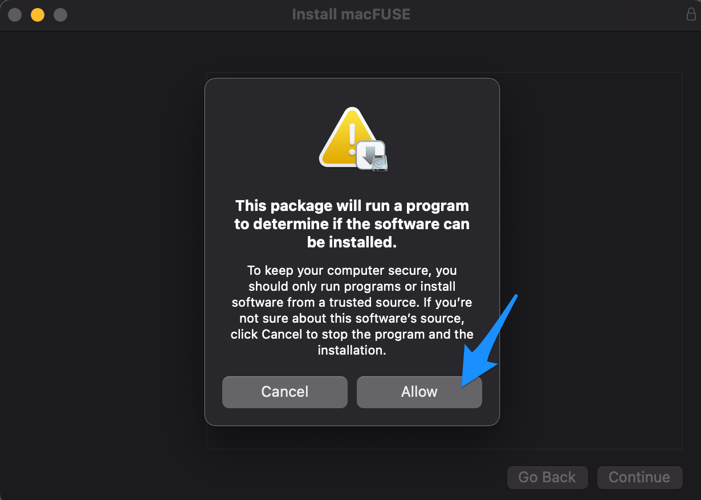
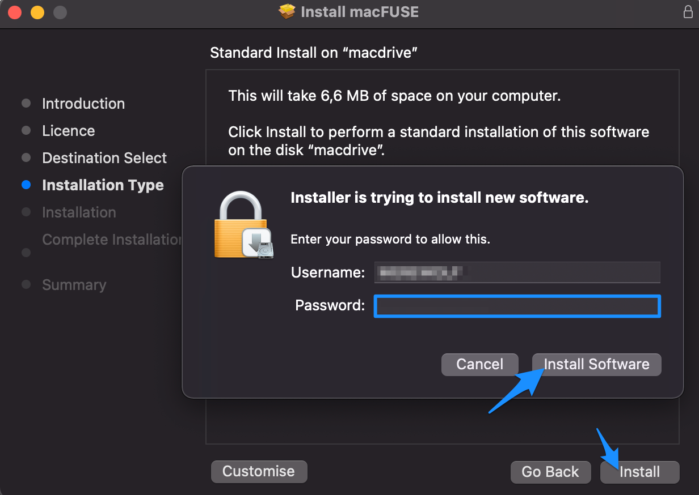
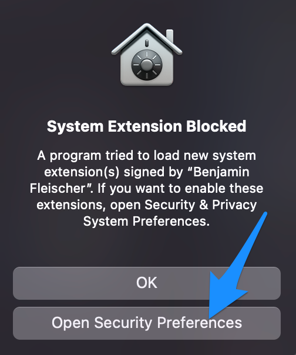
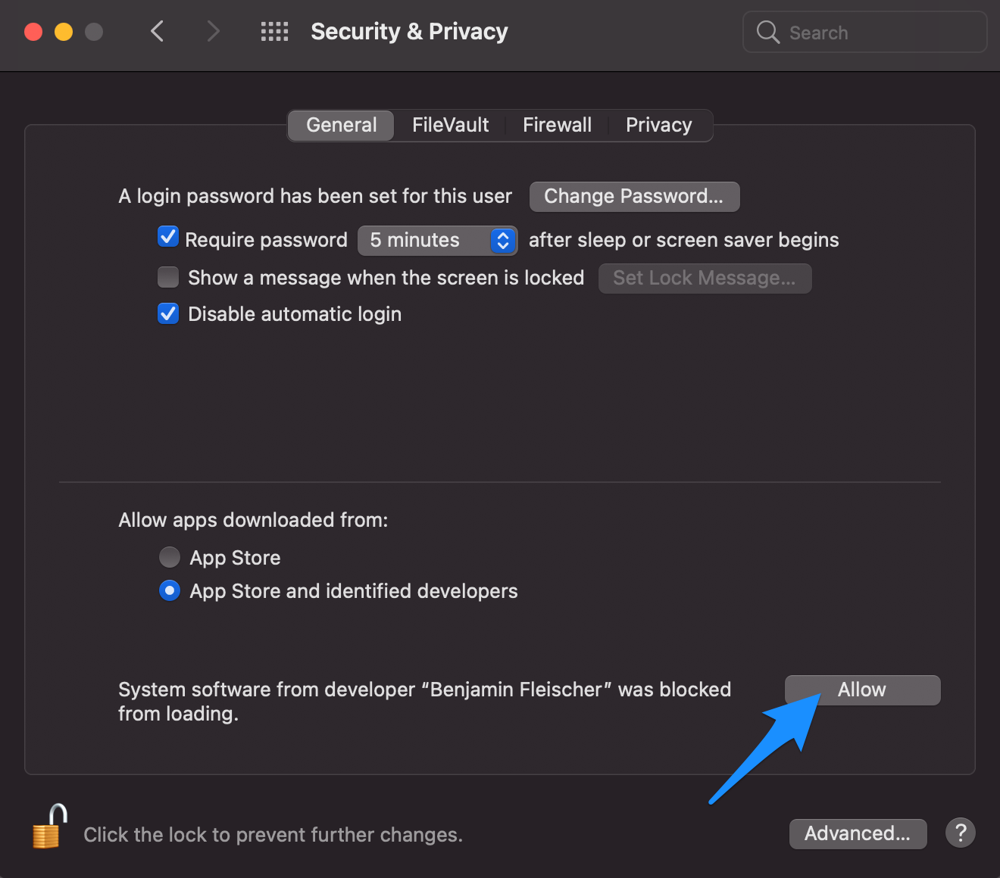
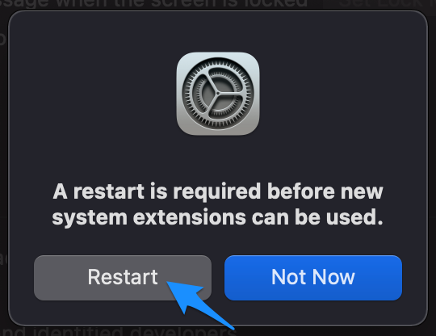
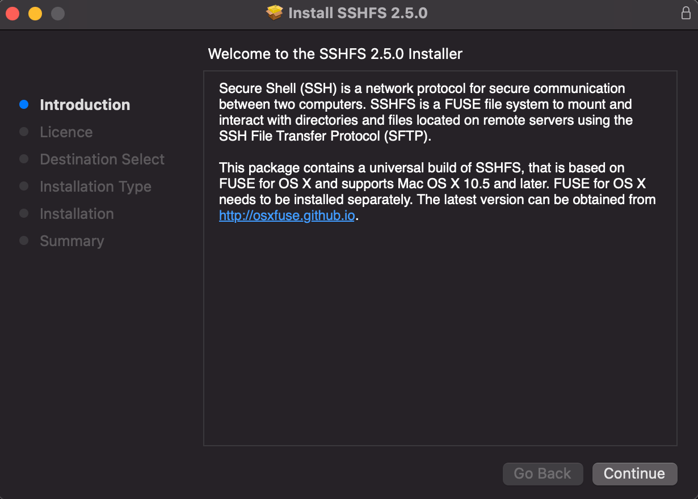
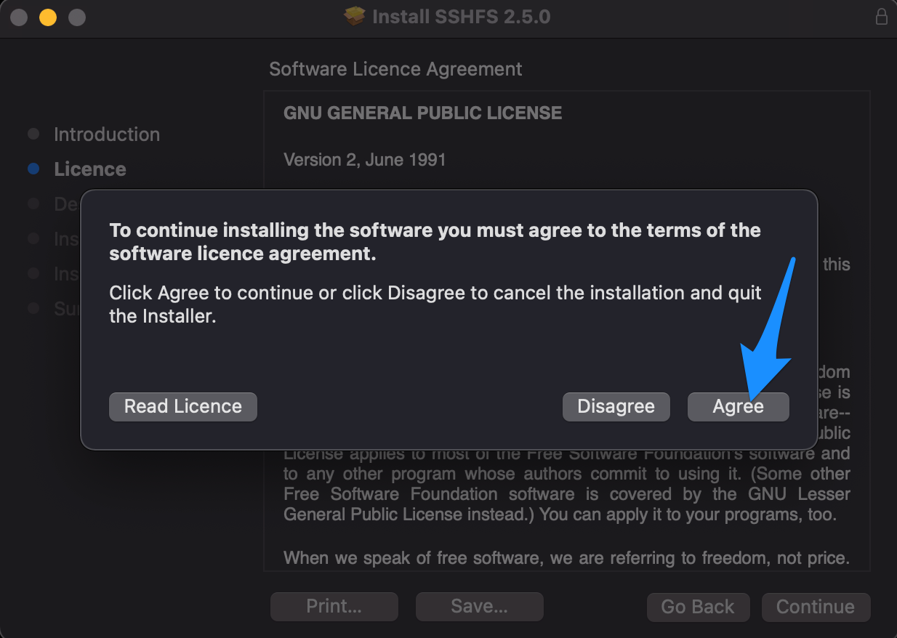
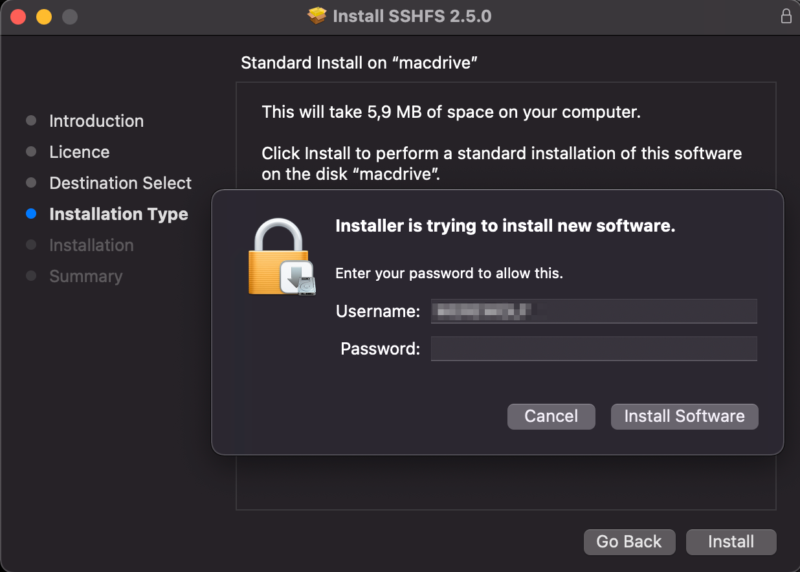
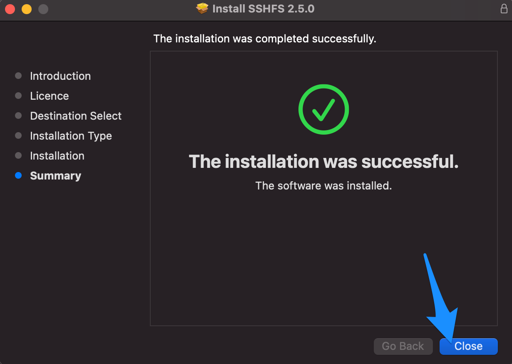

# SSHFS

**[SSHFS](https://en.wikipedia.org/wiki/SSHFS) is a filesystem client to mount and interact with directories and files located in your lab over a normal ssh connection.**


[[toc]]

## 1. Installation

Depending on the data safety level in your lab, you may mount selected part of your storage system to your client computer over VPN.


::: details Linux (Ubuntu)

Install sshfs:

   ```bash
   sudo apt install sshfs
   ```
:::


::: details OS X and macOS

**Requirement:**

You will need the Homebrew package manager for macOS to complete this guide: [Install Homebrew package manager for macOS: brew](https://brew.sh/).


**Warning:**

SSHFS installation on new versions of MacOS requires advanced installation with special permissions.
You are taking all the responsibility for setup of SSHFS and requirements it might need.


**Installation guide:**

1.1 Install macfuse:

   ```bash
   brew install --cask macfuse
   ```

1.2 Allow developer in `System Preferences` -> `Security & Privacy` -> `General`

1.3 Install sshfs:

   Download latest version of sshfs from [here](https://github.com/osxfuse/sshfs/releases), open and install it

1.4 Reboot your machine before continuing.

   ::: warning Request access

   If you do not see a section to enable develper in your `System Preferences` -> `Security & Privacy` -> `General`, you will need to contact your organiational IT support and request access to this section (NTNU Hjelp for NTNU managed Macbooks).

:::


## 2. Configure SSHFS

This step configures SSHFS on your local computer.

::: warning Requirements

A working HUNT Cloud VPN and and a working SSH connection to your lab.

:::


2.1. Open new Terminal window and define your labname as a variable.

   ```bash
   export labname=<labname>
   ```

   Change `<labname>` to your lab and run the line in the terminal on your local computer.

   ```bash
   # -- principal example
   export labname=demolab
   ```

2.2. Make a folder on your local computer that is dedicated as mount point for your lab storage:

Run this code without any changes since we defined your labname above.
   ```bash
   mkdir -v ~/${labname}-storage
   ```


2.3. Mount your labstorage over SSHFS to your local computer:

::: details For OS X and macOS
Run this code without any changes since we defined your labname above.
   ```bash
   sshfs ${labname}: ~/${labname}-storage -o follow_symlinks -o volname="${labname}-storage"
   ```
:::

::: details For Linux (Ubuntu)
Run this code without any changes since we defined your labname above.
   ```bash
   sshfs ${labname}: ~/${labname}-storage -o follow_symlinks
   ```
:::


**Simplify future access**

You can make an alias in your profile configuration file. This allows you to connect to the lab storage on your local computer with a simple command.

2.4. Connect to HUNT Cloud VPN

2.5. Make an alias in your profile configuration:

::: details For OS X and macOS

   ```bash
   echo "alias ${labname}-mount='sshfs ${labname}: ~/${labname}-storage -o follow_symlinks -o volname=${labname}'" >> ~/.profile
   ```
   The above example adds the alias to your `~/.profile` file. Depending on your preferences you may want to add this to other profile/rc config such as `~/.bash_profile`, `~/.bashrc`, or `~/.zshrc`).
:::

::: details For Linux (Ubuntu)
   ```bash
   echo "alias ${labname}-mount='sshfs ${labname}: ~/${labname}-storage -o follow_symlinks'" >> ~/.profile
   ```
   The above example adds the alias to your `~/.profile` file. Depending on your preferences you may want to add this to other profile/rc config such as `~/.bash_profile`, `~/.bashrc`, or `~/.zshrc`).
:::

2.6 Source your new alias.

```bash
source ~/.profile
```

2.7 Mount your storage:

  ```bash
  <labname>-storage
  ```

That's it.
With a little bit of luck you should be able to find your lab folders in "Finder"...
If not, don't hesitate to contact us [here](/contact) so we can improve this guide together.

## Good to know commands

### Unmount your lab storage

If you wish to stop the mount before you turn off your computer or vpn, you can turn it off with this command:

  ```bash
  sudo umount ~/<labname>-storage
  ```

## Troubleshooting

### Installation on macOS 11+

::: details Read more

Brew packages above are deprecated and if you are on new version or could not install old way download
macFUSE and SSHFS from [osxfuse.github.io](https://osxfuse.github.io/).

1. Download and open macFUSE:

    

2. Start installation and confirm that you trust the developer:

    

3. Read the info, then continue:

    

4. Approve if you want the installation to continue:

    

5. Switch to Security and privacy in System Preferences:

    

6. Confirm if you want to allow software from this developer to be used in the system,
   allowing this is necessary for sshfs to work:

    

7. Restart the system immediately if you plan to install sshfs:

    

After restarting the system, when necessary drivers are loaded, you can continue installing sshfs.

1. Download and open sshfs:

    

2. Confirm if you agree with license agreement:

    

3. Approve if you want the installation to continue:

    

4. Finish:

    

:::
