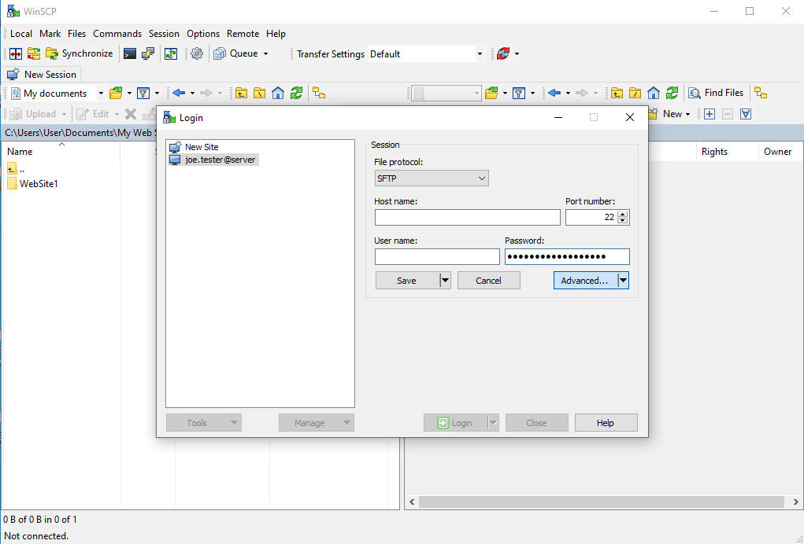
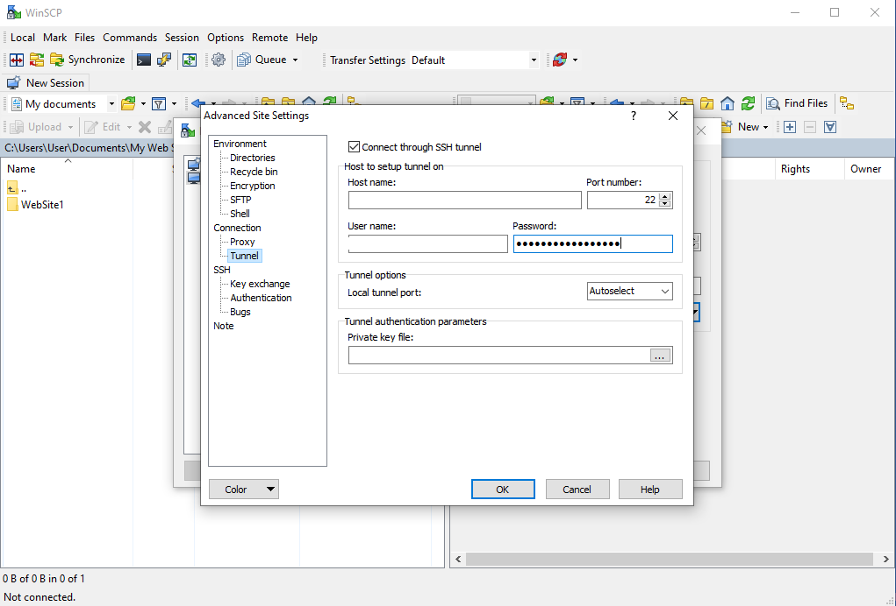
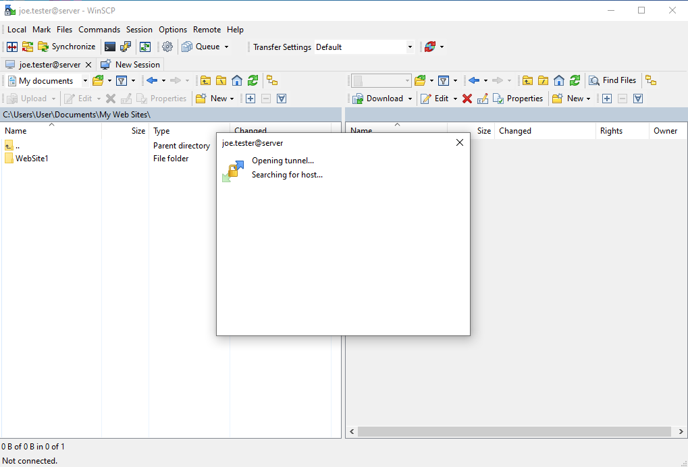
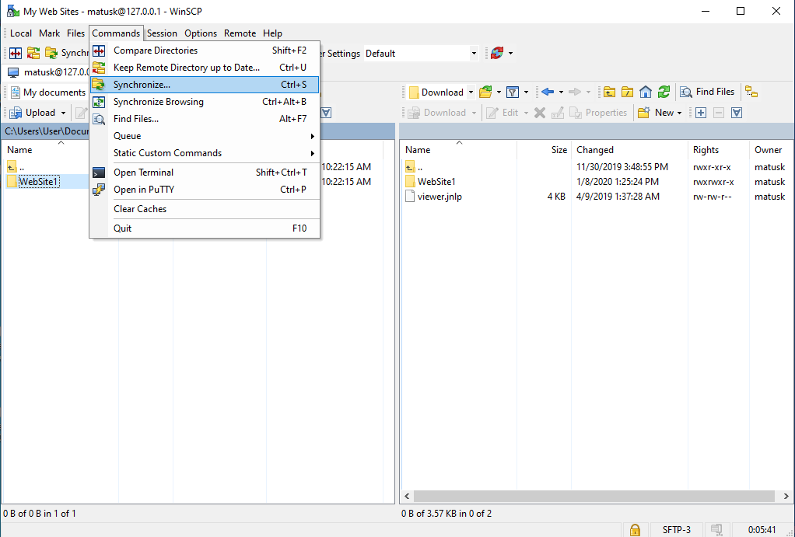
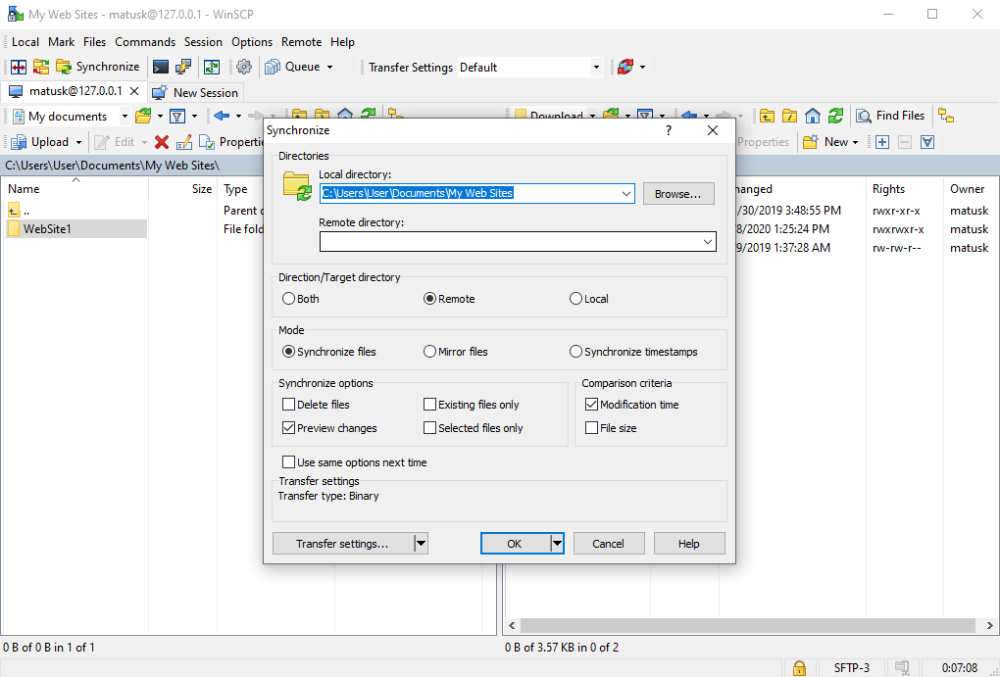
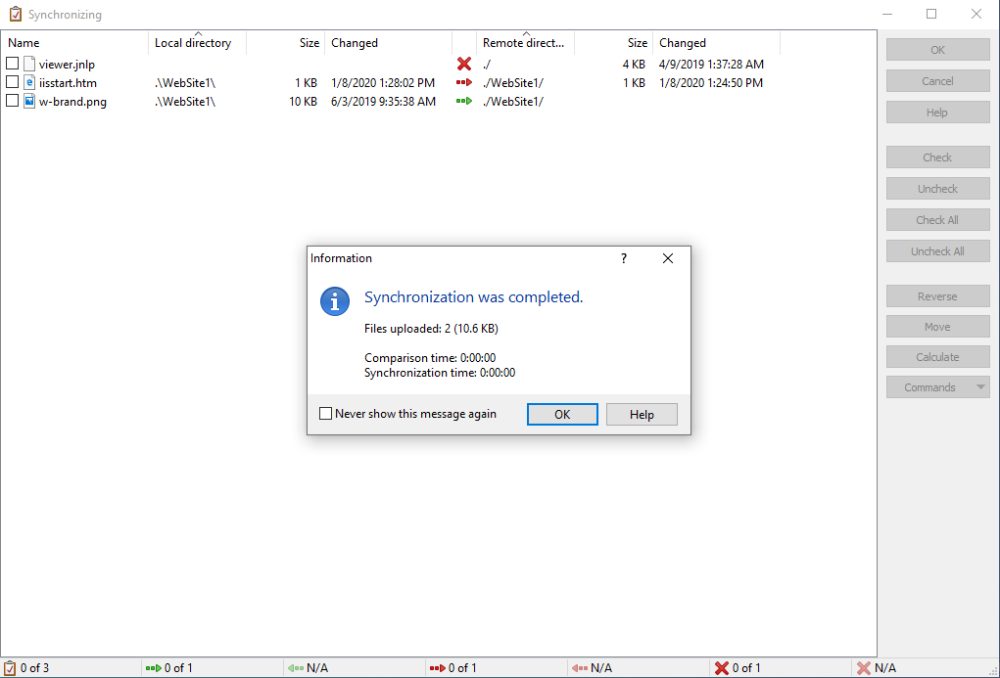

# WinSCP

**[WinSCP](https://winscp.net/) is an open source data transfer client for Windows that work with commonly used transfer protocols including SFTP, S3 and SCP.**

If your host organization allows, you can use WinSCP for file transfers and synchronization of folders between your local computer and your lab machines.

[[toc]]

::: warning Requirement
- Windows operating system.
- A [working connection](/do-science/lab-access/) to your lab.
:::

## Install

On your local computer, download WinSCP from [winscp.net](https://winscp.net/eng/download.php) and install the software. This may required administrator privileges.

## Configure

::: tip
This section configures WinSCP to connect your local computer to your [home machine](/do-science/faq/compute#machine-types). Additional configurations will be needed for connections to iaas and blue machines.
:::

You will see the **`Login`** screen when you start WinSCP for the first time.

In this **`Session tab`** insert:

- File protocol: **`SFTP`**
- Host name: **`10.5.5.12`**
- Protocol: **`22`**
- User name: **`<your-username>`**
- Password: **`<your-ssh-password>`**

Click **`Advanced`** and select **`Tunnel`**:

In the **`Tunnel tab`** insert:

- Connect through SSH tunnel: **`Check`**
- Host name: **`<your-lab-IP>`** (You can find your lab ip in your lab access link, if you don't have access to the link any more, request a new one through [here](https://docs.hdc.ntnu.no/do-science/service-desk/#request-lab-access-link-reissue)) 
- Protocol: **`22`**
- User name: **`<your-username>`**
- Password: **`<your-ssh-password>`**

Click **`Ok`** when completed.

Once you have confirmed the advanced settings you will get back to previous window. Hit **`Login`**.

With a little bit of luck, you should be able to see the files in your lab on the right side of your screen.

## Synchronize

[Synchronization](https://winscp.net/eng/docs/task_synchronize) is an additional feature that provides advanced copying. For example, when only a subset of updated files or only a new files have to be copied a lot of time can be saved compared to normal copy in WinSCP, which transfers all of the files every time your transfer a folder.

When selected the folder to be synchronized this option can be found in **`Commands`** menu as **`Synchronize...`** (Ctrl+S).

Synchronization allows multiple adjustments such as synchronization towards target, but also both ways. Whether one wants to synchronize deleted files or what comparison criteria one would like to use.

::: warning Be careful!
Selecting **`Both`** or **`Local`** targets will download data from your lab to your local computer. It is your responsibility to only use this configuration for folders in your lab that contains non-sensitive data that you can keep on your local computer.
:::

When confirmed, a file comparison is done by WinSCP, where one can choose files to be synchronized. Click **`Ok`** to confirm.

You will get a confirmation status when your synchronization is completed.

