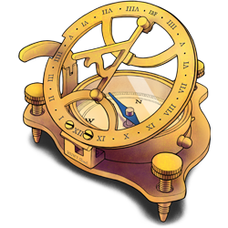

# Govern science in HUNT Cloud

**Welcome to our documentation for representatives that govern science in HUNT Cloud.**

This section is aimed at representatives for data controllers and service centers. See our [main documentation page](/) for other sections.

See our [organizational access](/govern-science/organizational-access) section for guidance on how new organizations can enable HUNT Cloud resources for their scientific centers and research groups. 

::: tip Next Tingweek #14 (2025-02)

- **Labting**: Tuesday 11 February 2025 - 2 to 3 p.m. CET
- **Admin ting**: Wednesday 12 February 2025 - 9 to 10 a.m. CET
- **Data controller ting**: Wednesday 12 February 2025 - 1 to 2 p.m. CET
- **Financial ting**: Thursday 13 February 2025 - 9 to 10 a.m. CET

[Read more](/govern-science/tingweek/)

:::

