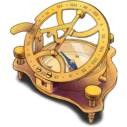

  

    <h1>Govern science in HUNT Cloud</h1>
    
Welcome to our documentation for representatives that govern science in HUNT Cloud.

  

  

    
  

  

    
This section is aimed at representatives for data controllers and service centers. See our <a href="/">main documentation page</a> for other sections.

  

  <NavigationCards :buttons="$frontmatter.buttons" />

