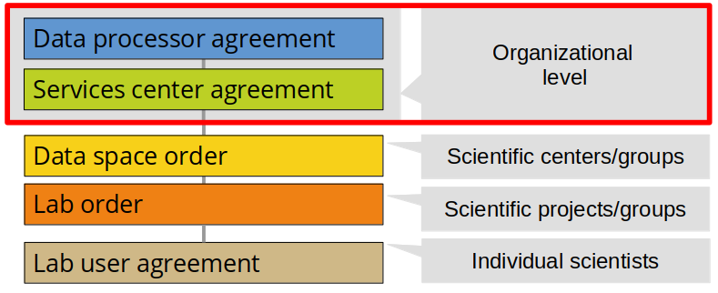
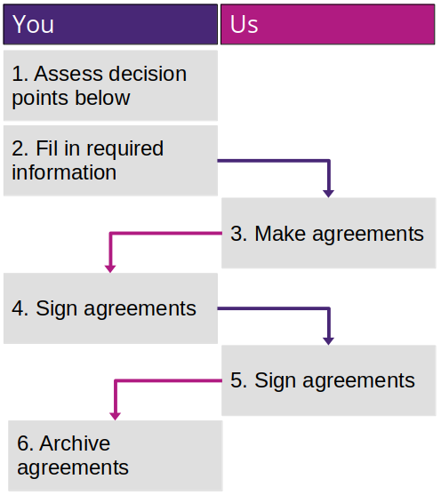

# Organizational access

**This pages provides a guide for organizations that wants to enable HUNT Cloud resources for their scientists and data explorers.**

::: tip Cut to the chase

[Click here](#request-organizational-agreements) to request the organizational agreements that we need before you can onboard your scientists to HUNT Cloud.

:::

[[toc]]

## Background

**The foundation for trustworthy data processing in HUNT Cloud is a solid agreement framework.**

We have five agreement layers in HUNT Cloud (illustration below). Two agreements at the organizational level needs to be in place before we can start onboarding your scientific centers, groups and projects.

## Agreements

### Data processor agreement

**The data processor agreement defines that your organization owns the data that you upload and generate in HUNT Cloud, and it specifies the privacy and security controls that are to be in place to protect your data.**

We use data processor agreement templates that is accepted by many organizations. These comply with requirements in GDPR, ISO 27001 and Norwegian health laws. Utilizing these templates is a quick way to ensure compliance with most requirements.

There is no direct cost for your organization associated with signing the data processor agreement with HUNT Cloud. 

[Read more about our data processor agreement](/govern-science/organizational-access/data-processor-agreement/)

### Service center agreement

**The services agreement specify how cloud resources are provided and billed so you get a unified way to control your organizational activity in HUNT Cloud.**

The service center agreement simplify the process for your scientific centers, groups and projects to establish their own Data spaces and Labs in HUNT Cloud that remains under your control.

There is no direct cost for the organizational unit that sign the service center agreement, for example Departments at universities. However, all Data spaces and Labs under your organizational unit that are attached to this agreement will be invoiced for their resource consumption in accordance with specifications defined here.

[Read more about our service center agreement](/govern-science/organizational-access/service-center-agreement/)

## Process overview

We need to collaborate on a few steps to complete your organizational onboarding:

## Decision support

**Are there already agreements in place between your organization and HUNT Cloud?**

If so, you may skip this section and directly contact your scientists so they can start their scientific onboarding of Data spaces and Labs. Ask inside your organization or [contact us](/contact) if you are unsure of the current agreement status. 

**Minor decision points are listed in the Agreement information form below.**

The form below contains several small decision points that organizations outside NTNU need to consider. [Contact us](/contact) on email if you need guidance in this process.

## Request organizational agreements

::: tip For NTNU departments
Send us the name of the administrative contact person at your Department that will coordinate the agreement process on [email](/contact). We will generate the additional agreement information and guide in the next steps.
:::

::: tip For all other institutions

[HUNT Cloud organizational agreement information form](https://assets.hdc.ntnu.no/assets/agreements/hunt-cloud-organizational-agreement-information.pdf) (pdf)

1. Click on the PDF-link above.
2. Fill out the needed information, and save the PDF on your local computer. 
3. Send us the saved PDF as an [email](/contact) attachment.

:::

Your scientific centers and groups may start their [scientific access](/administer-science/scientific-access/) process as soon as these organizational agreements are signed, sealed and delivered. 

## FAQ

See our [Organizational access FAQ](/govern-science/organizational-access/faq/) for frequently asked questions about organizational access to HUNT Cloud.
