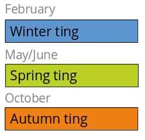
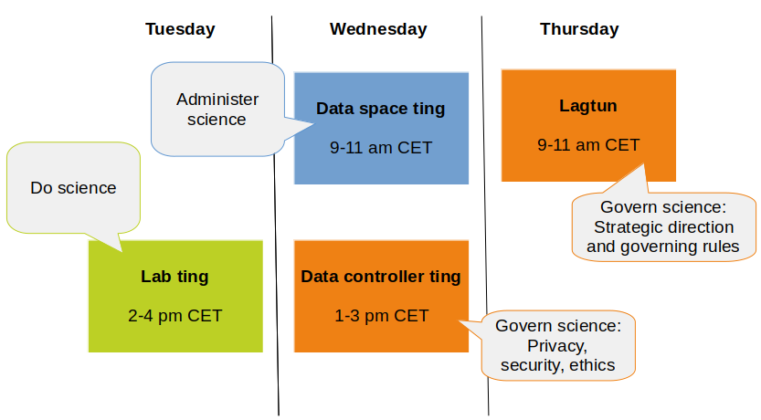

# HUNT Cloud Tingweek

**We appoint time three times per year to meet for information, feedback and discussions on how to develop the services in HUNT Cloud to better elevate science. We call these gatherings Tings.**

We arrange a layered set of Tings for distinct groups in our community. The meetings are spread out over one week in the winter, spring and autumn. We call these weeks "Tingweeks".

::: tip Next Tingweek (Ting #10)

- **Labting**: Tuesday 17 October 2023 - 2 to 4 p.m. CET
- **Data space ting**: Wednesday 18 October 2023 - 9 to 11 a.m. CET
- **Data controller ting**: Wednesday 18 October 2023 - 1 to 3 p.m. CET
- **Lagtun**: Thursday 19 October 2023 - 9 to 11 a.m. CET

:::

[[toc]]

## Tings

We have implemented a layered Ting structure to elevate voices and collective knowledge from distinct groups within the community. As of today, we appoint time for four different Tings that meet during the Tingweek:

### Labting

This is our allting were we focuses on **user experience inside labs**, and communication between lab users and with us. 

All active lab users, lab leaders and lab coordinators are invited for information, feedback and discussions on all aspects of existing, planned and future services. 

[Read more the Labting](/do-science/community/labting/) in our do science section.

### Data space ting

This is the Ting where we focuses on **cross-lab administration** in data spaces. 

All data space administrators are invited for information, feedback and discussion on compliance, data, technologies, knowledge and financial administration. 

::: details Previous name

The original Coordinator ting changed name to Data space ting in Tingweek #5 to reflect contractual roles in the new services model.

:::

### Data controller ting

This is the Ting where we initiate **cross-organizational dialogue on privacy, security and ethics** within HUNT Cloud. 

All privacy, security and compliance administrators are invited.

### Lagtun

Lagtun is the Ting where we appoint time to evolve data-driven science and the scientific direction for HUNT Cloud through cross-organizational discussions among **data controllers, service centers and large data spaces** in the community. 

Lagtun gives direct advice on our strategic and tactical development to the HUNT Cloud management in the form of resolutions. 

[Read more about Lagtun](/govern-science/tingweek/lagtun/).

## Memberships

Memberships to the Tings are derived from the following registered roles in contractual agreements with HUNT Cloud:

| Ting | Invitations |
| - | - |
| **Labting** | Active lab users. |
| **Data space ting** | Data space administrators. |
| **Data controller ting** | Data space compliance administrators, Privacy and security officers from Data controllers. |
| **Lagtun** | Representatives from Data controllers, Service centers and Data spaces on the BLUE subscription level ([read more](/govern-science/tingweek/lagtun/#attendance)). |

## Schedule

### Time of the year and dates

**Our Tingweeks are scheduled over one week in winter, spring and autumn.** 

* The **winter Ting** is scheduled mid February the week before Norway's winter holidays (vinterferie).
* The **spring Ting** is scheduled in late May / early June.
* The **autumn Ting** in scheduled in the second half of October the week after Norway's autumn holiday (høstferie) 

::: tip Ting dates
[Click here](/govern-science/tingweek/dates) to see past and future Ting dates. 

:::

### Weekly schedule

**Individual Tings are scheduled over the week on fixed time slots.** 

The current scheule is as follows: Labting is held on Tuesdays 2-4 pm CET, Data space ting on Wednesdays 9-11 am CET, Data controller ting on Wednesdays 1-3 pm CET and Lagtun on Thursdays 9-11 am CET.

## Reports

The intent of the Ting report is to give you the opportunity to read up on **what** we are doing at HUNT Cloud, and a little bit on **why** we do it. All so we can meet at the tings and have informed discussions on how to best elevate data for a better world!

We will not be able to make the reports for each Tingweek, although we will do our best to keep the list updated.

- [Ting report #6 (2022-05)](https://assets.hdc.ntnu.no/assets/tingweek/hunt-cloud-tingweek6-report.pdf)
- [Ting report #4 (2021-10)](https://assets.hdc.ntnu.no/assets/tingweek/hunt-cloud-tingweek4-report.pdf)
- [Ting report #3 (2021-05)](https://assets.hdc.ntnu.no/assets/tingweek/hunt-cloud-tingweek3-report.pdf)
- [Ting report #2 (2021-02)](https://assets.hdc.ntnu.no/assets/tingweek/hunt-cloud-tingweek2-report.pdf)
- [Ting report #1 (2020-10)](https://assets.hdc.ntnu.no/assets/tingweek/hunt-cloud-tingweek1-report.pdf)

