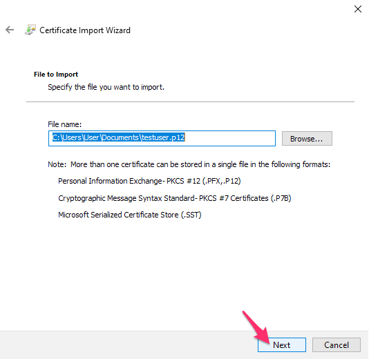
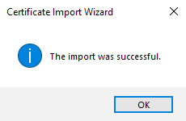
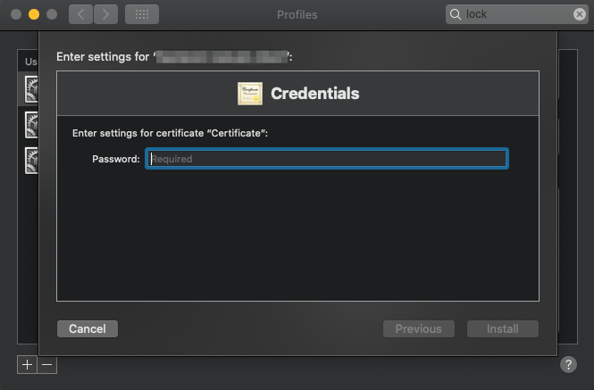
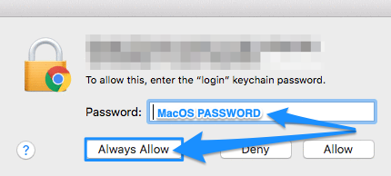

# Workbench renew certificate

If you already requested reissue of your expired certificate in [Service desk: Workbench access](/service-desk/user-orders/#workbench-access) and received your new certificate follow the steps below
to configure it.

::: details Windows

1. Open the p12 certificate. Make sure the store location is set to Current User and click next:

   

2. Continue clicking on next

   

3. Fill in the **`TLS passphrase`** that you received on signal, and make sure only the same option is checked exactly as in the image. Then click next:

   

4. Keep the first option to Automatically select the certificate store based on the type of certificate. Click next:

   

5. Your client certificate is imported and you can hit finish:

   

6. Wizard might require additional confirmation for installation of your Lab CA,
   and your Lab name should appear. Click yes to confirm if asked, or continue
   to the next step.

   

7. Quit your browser and restart it again for the certificate to get recognized.

   

:::

::: details OS X and macOS

1. Open the system profile config (.mobileconfig) attached in archive.

2. Confirm the installation of profile.

   

3. Enter the passphrase that you received on signal and then confirm.

   

4. Quit your browser and restart it again for the certificate to get recognized.

5. When opening Workbench for the first time you will be asked for macOS password,
   allowing the browser to access your client certificate stored in Keychain.
   After filling in the password you can confirm by clicking on `Always allow` / `Tillat alltid`.

   

:::

::: details Ubuntu Linux

We recommend that you use the [Google Chrome browser](https://www.google.com/chrome/) for predictability.

1. Open Chrome on your local machine.

2. Open url `chrome://settings/certificates` and click the `Import` button on the right side of the screen.

3. Browse and select your `.p12` file on your local machine and enter the `TLS passphrase` that you got on Signal.

4. Restart Chrome.

After the restart of Google Chrome the certificate is ready for network or secure web site client authentication.

:::

You should now be able to continue your work as before. For more information you can follow to our [Workbench guides](https://docs.hdc.ntnu.no/working-in-your-lab/workbench/) or [Workbench FAQ](https://docs.hdc.ntnu.no/working-in-your-lab/workbench/faq/).
