# Stata guide

**[Stata](https://www.stata.com/) is a handy general-purpose statistical tool from StataCorp. This guide aims to get you up and running with Stata in your workbench.**

[[toc]]

## Introduction

Stata in your workbench runs in a Jupyter notebook. This means that you can write known Stata commands and that you can view your plots directly on your screen. 

On the technical side, Stata runs on your lab home machine and conntect with your workbench via [stata_kernel](https://kylebarron.dev/stata_kernel/) developed by Kyle Barron.

## Open a Stata notebook

First, open your workbench and click on the Stata icon. This opens a new workbench that runs the `stata_kernel`.

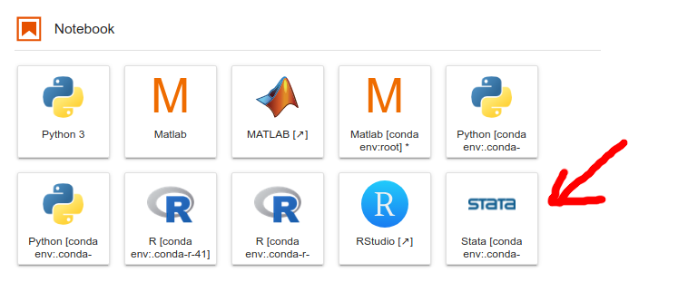

Look at the bottom of your screen to verify that Stata is loaded (`conda-sta`) and that your notebook is in an `Idle` state, meaning that it's ready to process your Stata commands.

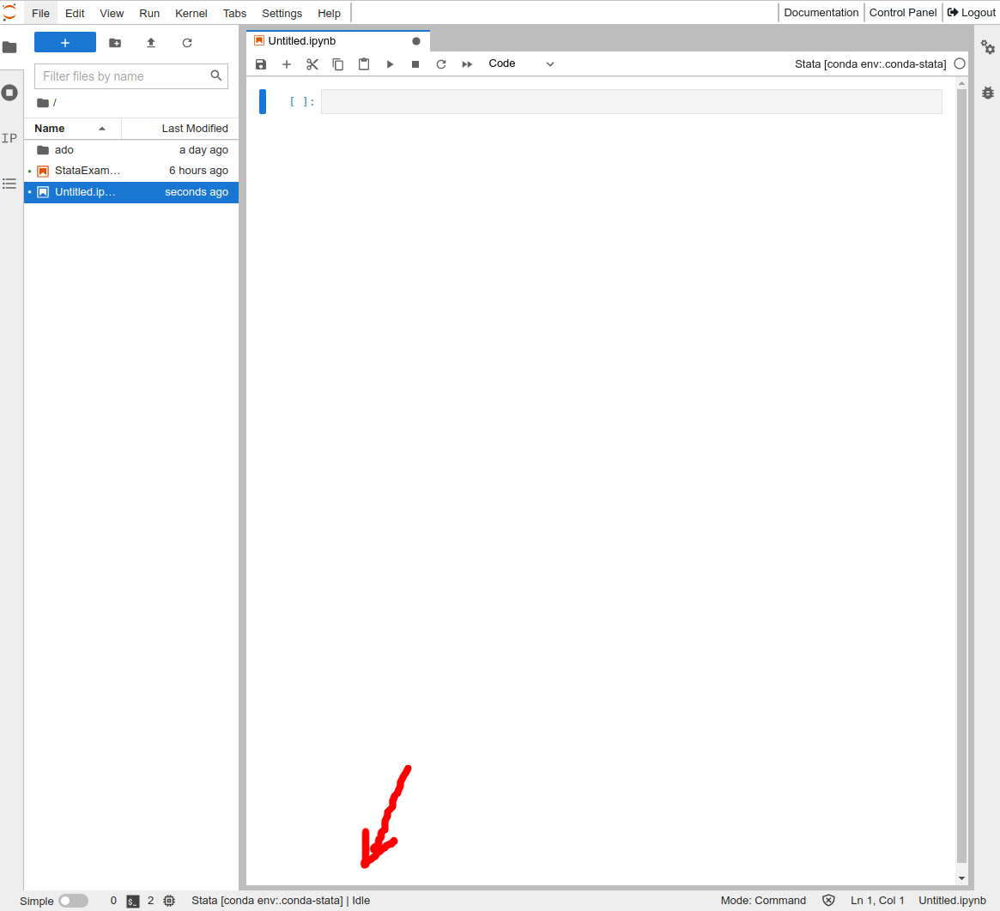
 
::: details Notebook states

* **Idle**. This means that your kernel is loaded and that your notebook is ready to process your commands.

* **Busy**. This means that your notebook is processing your commands. You should wait until it's back to `idle` before you run more code.

* **Connecting**. This means that your notebook is unable to connect to the kernel. You will not be able to run code until this is cleared. If it gets hung in a `connecting` state, click `Controal Panel` in the top right corner and stop and start your workbench to reset the connections.

* **Disconnected**. This means that your notebook is no longer connected to a kernel and you can not run your code until your restart your kernel.

:::


## Load data

Now that your new notebook is open, let's try to import data. Click on the first cell in your notebook and write the regular data import command from Stata.

```python
// load example data
sysuse auto
```

Your command should looks similar to this then included in the notebook:

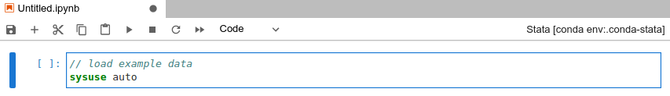

Then click on the cell and hit `shift+enter` on your keyboard or click the `play-button` at the top of your notebook to run the code. This will load the standard Stata `auto` dataset and acknowledge witht the text `(1978 Automobile Data)` which means that the command was completed successfully.

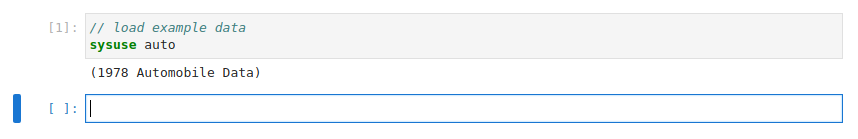

::: details Load data from your lab

Load data from your lab machine with the following command. 

```
// -- principal example
sysuse "/mnt/archive/data/test.dta"
```

Note that you need to add the path to your own data in the example above to make it work. 

:::

## Describe data

The `auto` data set is now available in your notebook for further investigation, for example by the `describe` and `summarize` commands. 

First, let's cut and paste the following text and hit `shift+enter` to run the command: 

```python
// describe your variables
describe
```

This should return a description of your data: 

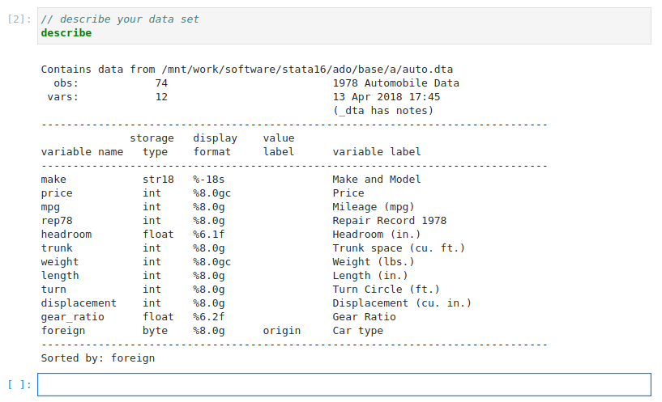

Then, let's try the `summarize` command: 

```python
// summarize your data
summarize
```

This should return a summary of your data: 

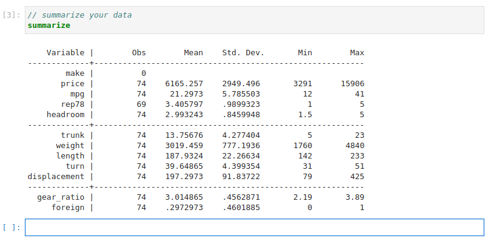


## View graphs

It's similar with the Stata graph functions. You run them in a cell, and the output gets visualized in your notebook. To illustrate, let's test with a few plots from UCLA's [introduction to Stata plotting](https://stats.oarc.ucla.edu/stata/modules/graph8/intro/introduction-to-graphs-in-stata/): 

```python
// make a scatter plot
scatter price mpg
```

This should print the plot on your screen: 

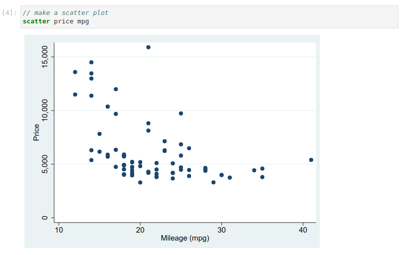

::: warning No plot?

[Contact us](/contact) if you don't see the plot.

:::

Here are a few more you can explore: 

```python
// make a histogram
histogram mpg
```
And before we head to the next section, a slighlty more advanced:

```python
// Twoway linear prediction plots with CIs
twoway (scatter mpg weight) (lfitci mpg weight), by(foreign)
```

You output should look similar to this: 

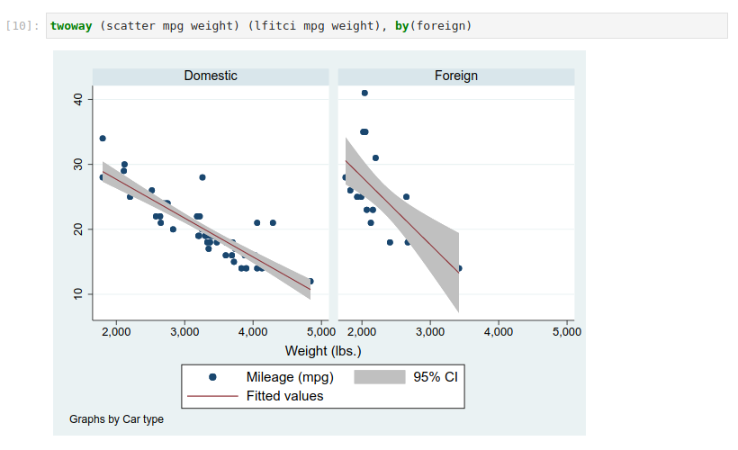

The generation of this plot uses a tiny bit more compute resources than the previous once, so depending on your home machine type, the notebook state at the botton of your notebook may shift from `Idle` to `Busy` in a few seconds while the graph is printed.

## Save graphs

You can also save your graphs in your lab with the `export` command: 

```pyhon
// save your latest graph
graph export mygraph.svg
```

The above command will save the latest graph that you viewed in your notebook in your workbench folder (red arrow). 


Click on the file to view the graph in your workbench, or click on the `download` icon to export the graph to your local machine. 

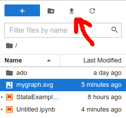

You can also save your graphs directly to other folders in your lab machine to they are instantly accessible for your lab colleagues:

```python
// Principal example of code that saves your 
// latest graph in a lab folder:
graph export /mnt/work/<folder>/mygraph.svg

// Practical example:
graph export /mnt/work/graphs/mygraph.svg
```


## Run analysis

We will not dive into data analytics in this guide since there are so many nice guides out there (such as these from [UCLA Advanced Research Computing](https://stats.oarc.ucla.edu/?s=stata)). Although, let's do to quick examples for fun: 

```python
// get mean value from a variable
mean mpg
```

The expected output should be like this: 

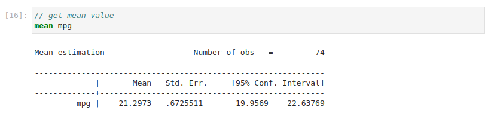

And let's end the guide with a regression example from [Statology](https://www.statology.org/multiple-linear-regression-stata/): 

```python
// run multiple linear regression with mpg and
// weight as explanatory variables and price
// as a response variable:
regress price mpg weight
```

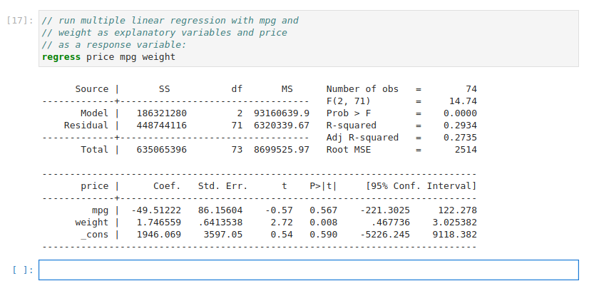


::: tip Time for coffee!

It's great to see that you followed the guide all the way to the end. Time to celebrate with a cup of fresh coffee before your start your exploration into your new workbench Stata world!

:::

If you miss something in this guide, please [contact us](/contact) so we together can improve the content for the next scientists in line.


