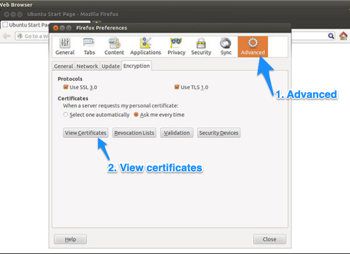

# Installation 

This guide will help you to connect with your your lab over your web browser. 

::: warning Requirements

- Working VPN and SSH as configured in the [Getting started](/getting-started/) guide.

:::

The new connection requires a certificate on your local machine to ensure encrypted and trustworthy communication.

::: tip Time estimate

Allow for **30 mintues** to complete this installation and some time to play around in your new environment.

:::

## 1.1 Collect keys

[Contact us](/contact) to request keys for your new web access if your are an existing lab user. New users will receieve keys for browser access as part of their regular onboarding. Example email: 

> Hi team, I would like to try my new web access and are looking forward to receive my keys. 

Similar to your initial onboarding, we will communicate your keys over Signal  and a link to your certificate over your organizational email.

You should expect an image with your **`TLS key`** on your phone and one (1) compressed file over email: 

::: warning Expect these files on your local machine

A successful opening of the 7z-file file should include two (2) files: 

- **`<labname>-<your-username>.p12`** - your TLS certificate. 
- **`<labname>-<your-username>.mobileconfig`** - your OS X and MacOS configuration file.

:::

## 1.2 Install certificates


::: details Windows

1. Open the p12 certificate. Make sure the store location is set to Current User and click next:

   

2. Continue clicking on next

   

3. Fill in the passphrase that you received on signal, and make sure only the same option is checked exactly as in the image. Then click next:

   

4. Keep the first option to Automatically select the certificate store based on the type of certificate. Click next:

   

5. Your certificate is imported and you can hit finish:

   

6. Quit your browser and restart it again for the certificate to get recognized.

:::


::: details OS X and macOS

1. Open the system profile config (.mobileconfig) attached in archive.

2. Confirm the installation of profile.

3. Enter the passphrase that you received on signal and then confirm.

4. Quit your browser and restart it again for the certificate to get recognized.

:::


::: details Ubuntu Linux

1. Open Firefox on your local machine. 

You can install Firefox on your local machine with the following code: `apt install firefox`. 

2. Open url `about:preferences#privacy` or click `Edit` > `Preferences`.

   

3. Click Options > Advanced > Encryption. Click View Certificates.

   

4. Select the Your Certificates tab. Click Import.

   

5. Browse for and select your PFX file. Enter the password.

   

6. Click OK.

   

7. Restart Firefox. 

The certificate is now installed and can be used for network or secure web site client authentication after the restart of Firefox.

:::

## 1.3 Open your new workbench

1. Open the your web browser (Firefox is required for Linux). 

2. Type in the URL address to your lab in your browser.

```bash
# -- Principal example
https://<labname>.lab.hdc.ntnu.no

# -- Demo example
https://demolab.lab.hdc.ntnu.no
```

3. Sign in with your HUNT Cloud lab username and lab password. This is the password that you made on your first login. 

4. With a little bit of luck you should now see your new workbench. Click around and play in your new world.

  


## Immediate troubleshooting

#### I don't remeber my password

Don't worry. [Contact us](/contact) on email for a password reset. 

