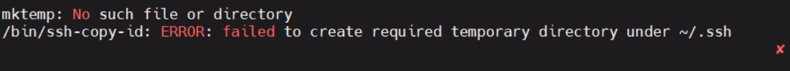
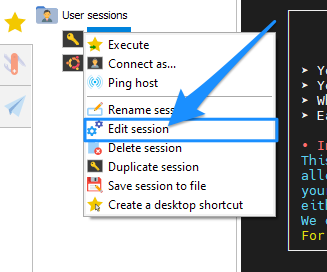
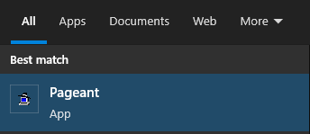
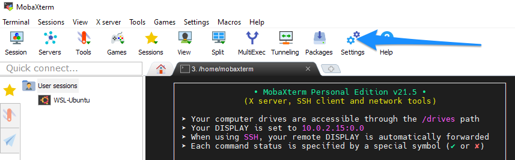
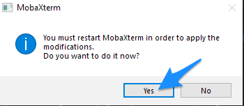
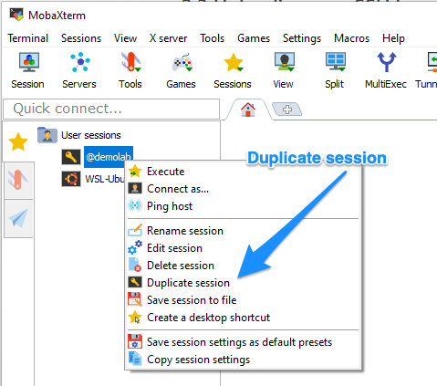
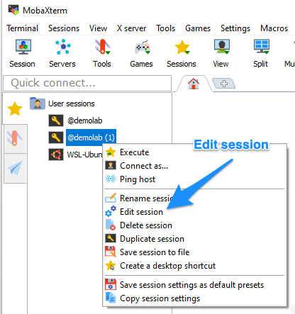
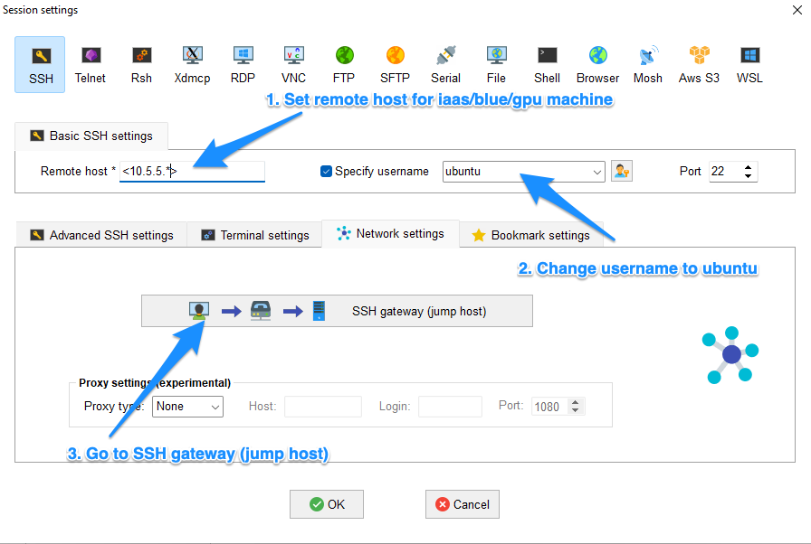
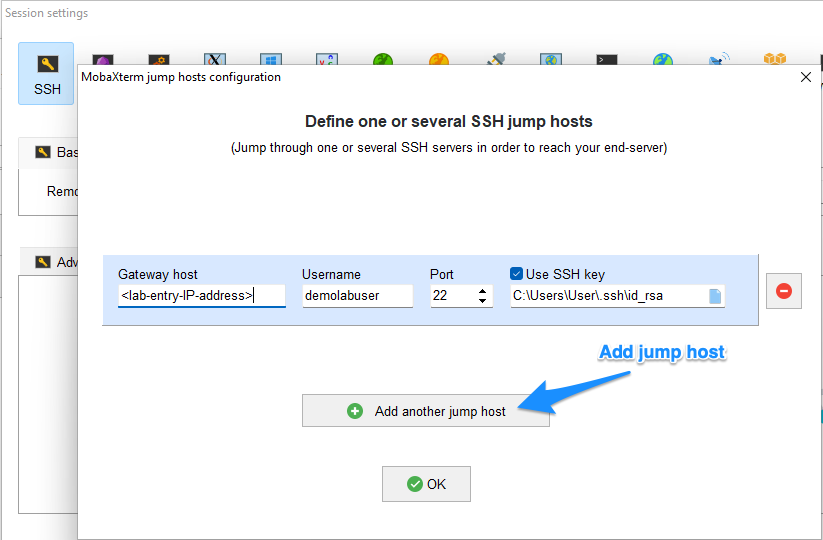
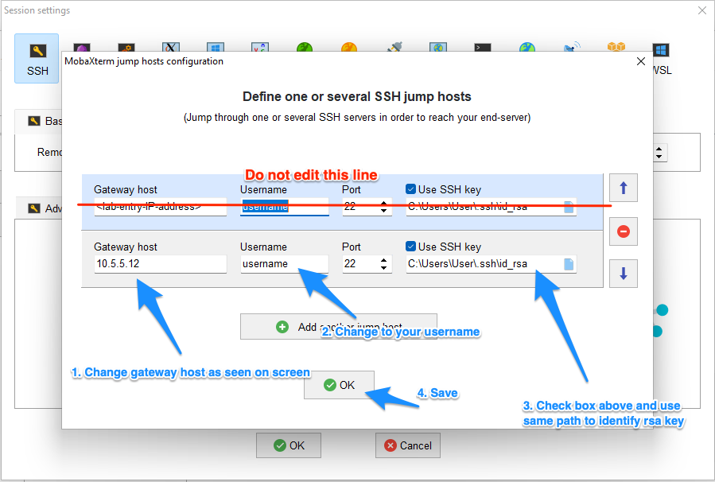

# MobaXterm

**[MobaXterm](https://mobaxterm.mobatek.net/) is an application that simplifies SSH connections to your lab from your local Windows machine.**

[[toc]]

::: warning Requirements

(1) A working SSH connection to both entry and home as described in the [How To Connect To Your Lab](/getting-started/) guide.

(2) The MobaXterm configuration file to simplify your setup. You can order a new one in the [service desk](/service-desk/user-orders/#mobaxterm-configuration-file).

Without these it will be hard to ensure a smooth MobaXterm configuration.

:::

## 1. How to install

::: tip
Lab users from NTNU can install MobaXterm using the software center.
:::

- Download the `Home edition (installer edition)` from [mobaxterm.mobatek.net](https://mobaxterm.mobatek.net/download.html):
- Unzip the file and install the software

## 2. Generating SSH Key

In case you have not used SSH keys before and you need to generate one, on Windows you can do so in MobaXterm using Local terminal

### 2.1 Open Local terminal

Clicking on Local terminal button opens MobaXterm command line:


### 2.2 Generate SSH key in local terminal

When you click "Start local terminal", you should see a window similar to this:


Before you start, check if you already have a ssh keys in place by running this command:

::: warning
Do **not** rewrite variables in commands. Keep `${USERPROFILE}` as is.
:::

```bash
cat "${USERPROFILE}/.ssh/id_rsa.pub"
```

If the above command prints several rows of random letters on the screen, you already have a ssh keys that can be used. Jump to section 2.3.

If the above command print error message (No such file or directory) or there was no output, you probably don't have your ssh key yet. Continue with the folloing steps:

First, before creating your new SSH key make sure that your .ssh directory exists:

```bash
mkdir -p "${USERPROFILE}/.ssh"
```

Then, create your new SSH key:

```bash
ssh-keygen -b 4096 -t rsa -f "${USERPROFILE}/.ssh/id_rsa" -q -N ""
```

### 2.3 Uploading new SSH key

To be able to use the key you need to be upload it to your lab with the `ssh-copy-id` command. You will be asked to type in your SSH password that you made during the lab installation during this prosess.

```bash
ssh-copy-id -i "${USERPROFILE}/.ssh/id_rsa.pub" <username>@<entry-IP>
```

**Note.** Replace `username` with your username, and `entry-IP` with IP address of your lab that is included in your `ssh-config.txt` file (format: `10.42.X.Y`). Example: `joe-tester@10.42.2.32`.

If you get asked to save the password, refuse by clicking on `No` to make sure that MobaXterm will authenticate with SSH keys instead of passwords.


## 3. Connect

We usually ship preconfigured Moba file with credentials. You can open it now and MobaXterm will pick up your lab session.


With a little bit of luck, you should now be able to connect directly from your client computer to your home node in your lab.

::: tip Request a new Moba file

[Contact us](/contact) for a new Moba file with credentials and configuration if you need one.

:::

## Troubleshooting


#### Mktemp error

::: details More information

- If you are getting this error when trying `ssh-copy-id`:
  

- Run this command with `TMPDIR` variable:
  ```
  # -- Non-working example
  TMPDIR="${USERPROFILE}" ssh-copy-id -i "${USERPROFILE}/.ssh/id_rsa.pub" <username>@<entry-IP>
  ```

**Note.** You need to replace `<username>` with you username (without the brackets), and `<entry-IP>` with your entry IP from the SSH config file.

:::


#### Check SSH keys in session configuration

::: details More information

- Right click on the session that you want to edit and choose option `Edit session`.
  
- Assure `SSH` option under the `Session settings` is selected.
- In **Advanced SSH settings** make sure that private key option is checked. Then select the path to SSH key file (`id_rsa`).
  
- Under `Network settings`, click on `Connect through SSH gateway (jump host)`
  
- Check `Use SSH key` option and select the path to SSH key file (`id_rsa`).
  
- Confirm session settings by clicking `OK`.

:::

#### Agent refused operation

::: details More information

If you see the error message saying: `Agent refused operation` you need to install Putty.


Once Putty is installed, make sure that MobaXterm is closed and started Pageant. Pageant is part of Putty installation.



Once Pageant is running, you can start MobaXterm.

:::

#### Configure custom SSH config

::: details More information

This part might be needed if you plan to use SSH tunnel. It is not part of recommended workflow.

To setup ssh config to be used in local terminal of MobaXterm use:

```
cat <<-EOF > /home/mobaxterm/.ssh/config

Paste content of your ssh-config.txt here

EOF
```

:::


## Advanced

#### Configure custom session

::: details More information

- Open MobaXterm
- Select a new session and click on the `SSH` image on the `Session settings`.
- In **Basic SSH settings**, add `10.5.5.12` as `Remote host` and type your username into `Specify username` field. Under **Advanced SSH settings** uncheck `X11-forwarding` if not used. Select ssh (private) key file if you already have one.
  
- Under `Network settings`, click on `Connect through SSH gateway (jump host)`
  
- Add your labs IP-address to the `Gateway SSH server` and your user name to the `User` field (the 10.42.-address from the ssh-config). Select ssh (private) key file if you already have one. Click OK to confirm SSH jump host.
  
- In **Bookmark settings**, Name your lab session. Click OK to confirm Session settings.
  

:::


#### Configure MobaAgent

::: details More information

1. Start MobaXterm and open Settings:



2. Choose SSH tab and make sure that option `Use internal SSH agent "Mobagent"` is checked. Then click OK to save the settings.


3. If you are asked to confirm restart of MobaXterm click `Yes` to confirm.



4. (optional) if you have not setup ssh before, follow section 2 above (generating SSH key)

5. Add SSH key into Mobagent

Check the list of Mobagent SSH keys and make sure that SSH key (`id_rsa` file) is included.


If MobaXterm included the new key automatically, you can continue to the next step. If your `SSH agents` list is empty, click on the plus sign (arrow marked "2.") and add your new `id_rsa` file (key) to the list. You will find the file on your local machine under this path: `C:\Users\<yourlocalusername>\.ssh\id_rsa`.

:::

#### Configure custom session for Blue/IAAS/GPU machine

::: details More information

1. Duplicate your current lab session



2. Edit duplicated session (feel free to rename it as well)



3. Set options as described below



4. Add jump host for home machine.





5. Save and enjoy ! 

:::
