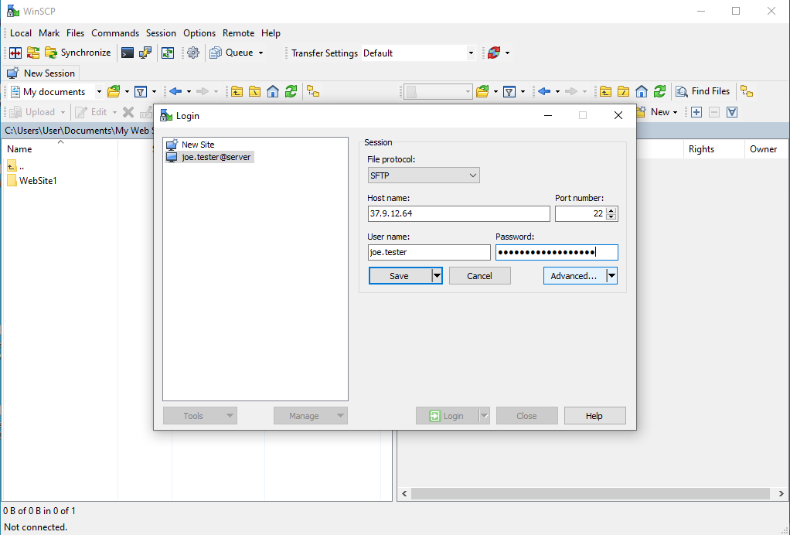
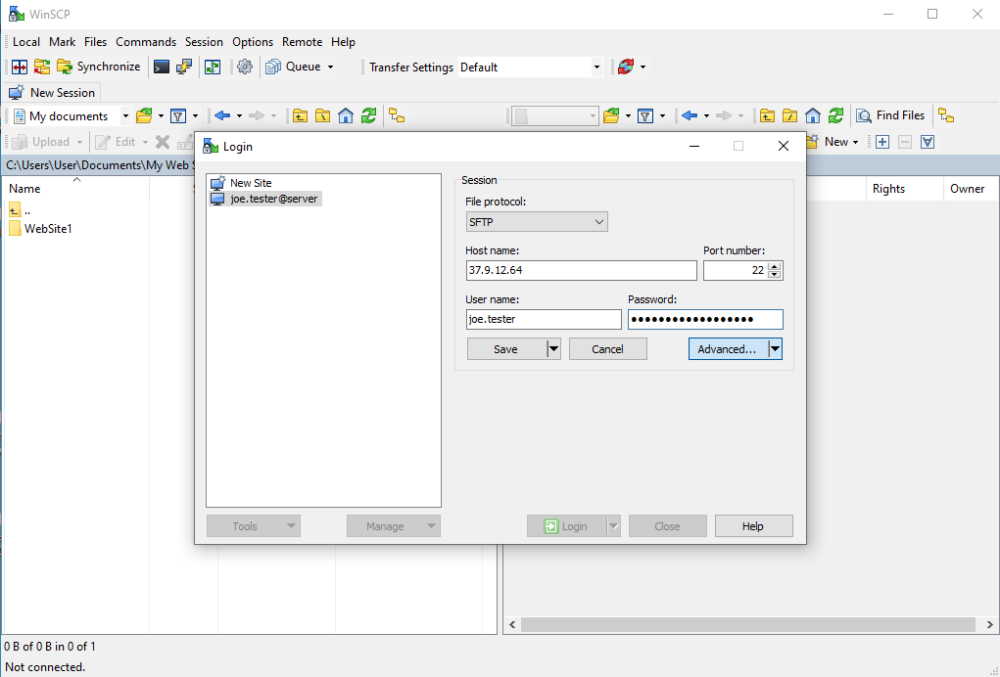
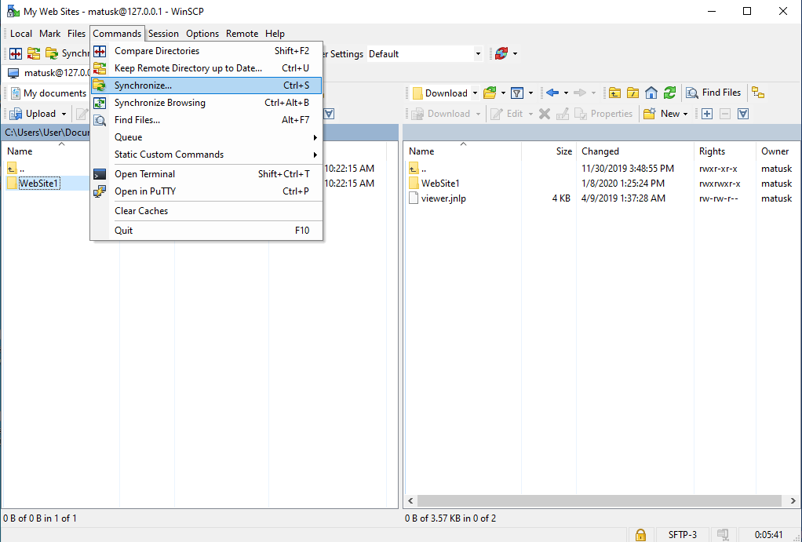
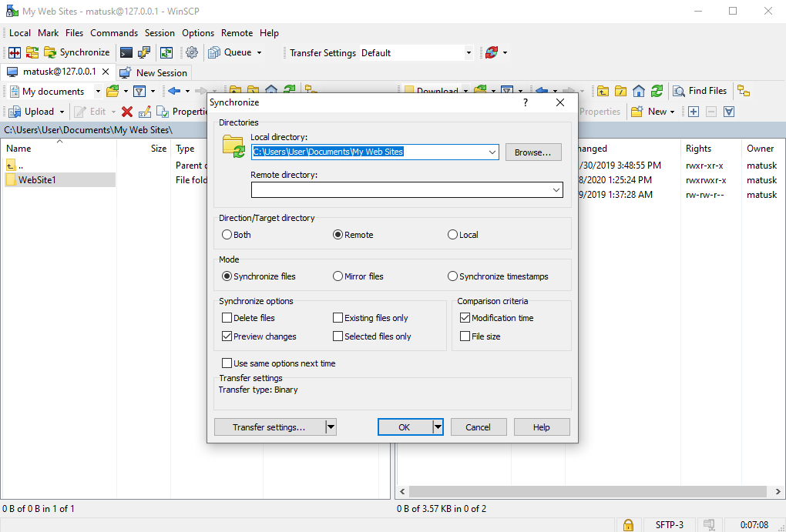

# WinSCP

[WinSCP](https://winscp.net/) is an open source SFTP, FTP, WebDAV, S3 client and SCP client for Windows. It is mainly used for file transfer between a local compute and a remote server.

[[toc]]

::: warning Requirement
- Windows operating system.
- A [working connection](/getting-started/) to your lab.
:::

## Download and install

Download WinSCP from [winscp.net](https://winscp.net/eng/download.php) and install the software. This may required administrator privileges.

## Connection tunnelling

In order to reach an (s)ftp destination behind another server, we can use [SSH tunneling](https://winscp.net/eng/docs/tunneling).

In the session we fill up the host name of a destination server where the sFTP actually is.

Then in advanced settings as shown in the picture we follow with defining SSH Tunnel.

Under the `Connection > Tunnel` option we enable `Connect through SSH tunnel` and fill up the host name of SSH entry server. We can use the username and provide password later when connecting, if we do not want to keep it saved.

Once we confirmed the advanced settings we get back to previous windows and when we hit login WinSCP will first connect to SSH entry server to open a tunnel and then our destination server.

## Synchronization

[Synchronization](https://winscp.net/eng/docs/task_synchronize) is an additional feature that provides advanced copying. In cases when only a subset of updated files or only a new files have to be copied a lot of time can be saved compared to normal copy in WinSCP, which transfers all of the files.

When selected the folder to be synchronized this option can be found in `Commands` menu as `Synchronize...` (Ctrl+S).

Synchronization allows multiple adjustments such as synchronization towards target, but also both ways. Whether one wants to synchronize deleted files or what comparison criteria one would like to use.

When confirmed a comparison is done by WinSCP, where one choose from the files to be synchronized and confirm.

When synchronization is completed we get a confirmation status.

