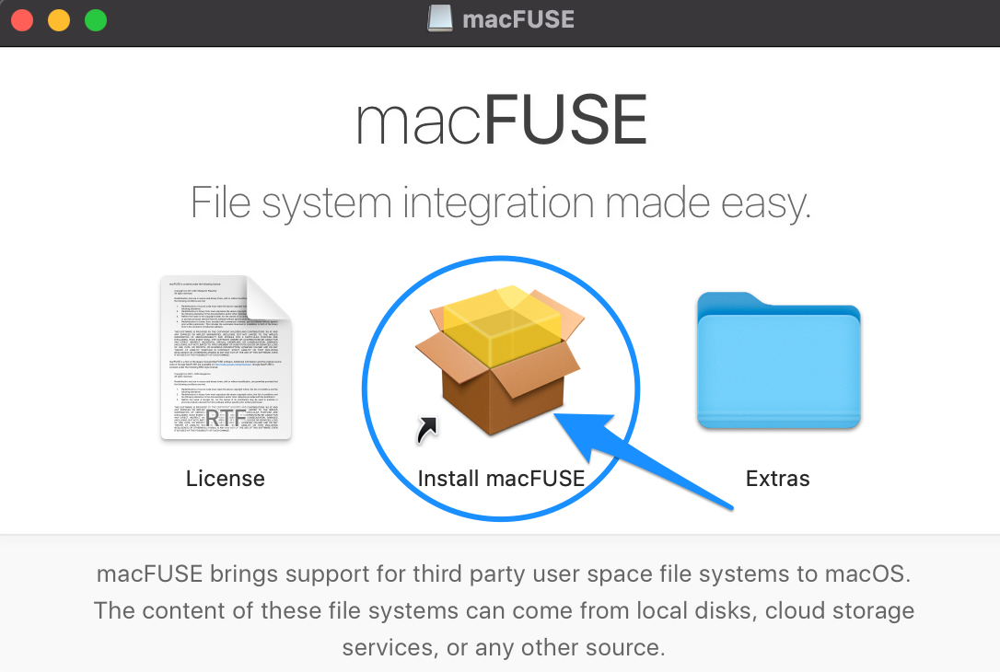

# SSHFS

**This page describe how you can mount your labs file system over an encrypted connection on Linux and Mac to your local client machine.**

Depending on you security model, you may mount selected parts of your storage system to your client computer over VPN.

::: warning Requirements

You will need a working HUNT Cloud VPN and SSH connection to your lab to complete this guide.

:::

## 1. Installation 

This step install SSHFS on your local computer.

::: details OS X and macOS

**Requirement:** 

You will need the Homebrew package manager for macOS to complete this guide: [Install Homebrew package manager for macOS: brew](https://brew.sh/).

**Installation guide:**

1.1 Install macfuse:

   ```bash
   brew install --cask macfuse
   ```

1.2 Allow developer in `System Preferences` -> `Security & Privacy` -> `General`

   ::: warning Request access
   
   If you do not see a section to enable develper in your `System Preferences` -> `Security & Privacy` -> `General`, you will need to contact your organiational IT support and request access to this section (NTNU Hjelp for NTNU managed Macbooks).

1.3 Install sshfs:

   Download latest version of sshfs from [here](https://github.com/osxfuse/sshfs/releases), open and install it

4. Reboot your machine before continuing.

:::


::: details Linux (Debian)

Install sshfs:

   ```bash
   sudo apt install sshfs
   ```
:::


## 2. Configure SSHFS

This step configures SSHFS on your local computer.

::: warning Requirements

A working HUNT Cloud VPN and and a working SSH connection to your lab.

:::

2.1. Connect your HUNT Cloud VPN and open the terminal of your local computer.

2.2. Define your labname as a variable.

   ```bash
   export labname=<labname>
   ```
  
   Change `<labname>` to your lab and run the line in the terminal on your local computer.
   
   ```bash
   # -- non-working example
   export labname=demolab
   ```

2.3. Make a folder on your local computer that is dedicated as mount point for your lab storage:

   ```bash
   mkdir ~/${labname}-storage
   ```

Run this code without any changes since we defined your labname above.

2.4. Mount your labstorage over SSHFS to your local computer:

   ```bash
   # -- For OS X and macOS
   sshfs ${labname}: ~/${labname}-storage -o follow_symlinks -o volname="${labname}-storage"

   # -- For Linux (Debian)
   sshfs ${labname}: ~/${labname}-storage -o follow_symlinks
   ```
   
Run this code without any changes since we defined your labname above.

**Simplify future access**

You can make an alias in your profile configuration file. This allows you to connect to the labstorage on your local computer with a simple command.

2.5. Make an alias in your profile configuration:

   ```bash
   # -- For OS X and macOS
   echo "alias ${labname}-mount=sshfs ${labname}: ~/${labname}-storage -o follow_symlinks -o volname=${labname}" >> ~/.profile
   
   # -- For OS X and macOS
   echo "alias ${labname}-mount='sshfs ${labname}: ~/${labname}-storage -o follow_symlinks'" >> ~/.profile
   ```
   The above example add the alias to your `~/.profile` file. Depending on your preferences your may want to add this to other profile/rc config such as `~/.bash_profile`, `~/.bashrc`, or `~/.zshrc`).
   
2.6 Source your new alias. 

  ```bash
  source ~/.profile
  ```

2.7 Mount your storage: 

  ```bash
  <labname>-storage
  ```

With a little bit of luck you should now be able to find your lab folders in "Finder"... If not, don't hesitate to contact us [here](/contact) so we can improve this guide together.

## Good to know commands

### Unmount your lab storage

If you wish to stop the mount before you turn off your computer or vpn, you turn it off with this command:

  ```bash
  sudo umount ~/<labname>-storage
  ```

## Troubleshooting

### Installation on macOS 11+

::: details Read more

Brew packages above are deprecated and if you are on new version or could not install old way download
macFUSE and SSHFS from [osxfuse.github.io](https://osxfuse.github.io/).

1. Download and open macFUSE:

    

2. Start installation and confirm that you trust the developer:

    

3. Read the info, then continue:

    

4. Approve if you want the installation to continue:

    

5. Switch to Security and privacy in System Preferences:

    

6. Confirm if you want to allow software from this developer to be used in the system,
   allowing this is necessary for sshfs to work:

    

7. Restart the system immediately if you plan to install sshfs:

    

After restarting the system, when necessary drivers are loaded, you can continue installing sshfs.

1. Download and open sshfs:

    

2. Confirm if you agree with license agreement:

    

3. Approve if you want the installation to continue:

    

4. Finish:

    

:::
