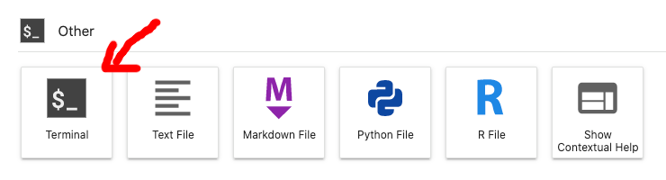

# Workbench FAQ

**This page contain frequently asked questions about Workbench. Help us expand this section by [sending us questions and ideas](/contact) for new content.**


[[toc]]

::: tip Troubleshooting

Head over to our [workbench troubleshooting](/working-in-your-lab/workbench/troubleshooting/) section if something is not working as expected.

:::


## Storage

### Where is my data?

Workbench uses the same storages volumes as your home machine. This means that you can access all lab data, including your home directory, using the same paths in your scripts, for example:

```bash
/mnt/archive/<my-data-folder>
```

### Where is my workbench code stored?

Jupyter Notebooks and code are stored in the shared `work` volume on your home machine:

```bash
/mnt/work/workbench
```

## Reproducibility

### Can I create my own Conda environment for Jupyter?

Yes. Here's an example on how you create a Conda environments with Python and IPython kernel:

```
conda create -n <name> 'python==3.8' 'ipykernel'
```

And here's an example on how you create a Conda environment with R and R-IRkernel kernel and commonly used packages:

```
conda create -n <name> 'r-base>=4.0,<5.0' 'r-irkernel' 'r-devtools' 'r-remotes' 'r-dplyr' 'r-tidyverse' 'r-haven'
```

### How can I start a Notebook with my new Conda environment?

Here is an example of Notebooks that are connected to Conda environments.


### How do I change the Conda environment for my Notebook?

You can also change Conda environment of your Jupyter Notebook later, by switching the kernel:


You will be able to select default environments including MATLAB kernel and custom environments which contain either `ipykernel` (Python) or `r-irkernel` (R 4.0):


### How can I install apt packages?

We recommend that you install apt packages in your Conda environments since these will be installed on disk and such be persistent during restarts (regular apt commands run in terminal will be removed during your next restart). Search [anaconda](https://anaconda.org/) to identify your package name and get going with your installation.


## Management

### How can I restart my Workbench environment?

Sometimes you might want to start over with a fresh environment:

(1) Select control panel in top right corner:


(2) Then in the control panel hit stop server:


You can either start the new instance by hitting the button or by logging in again.

### Can I install Jupyter extensions?

No. Due to security reasons, this is currently not allowed and the Jupyter extension manager is disabled. Feel free to reach out to us on Slack so we can discuss adding useful extensions into your Workbench.


## MATLAB

### Are there any limitations to MATLAB in Workbench?

Yes, some limitations to web-based version of MATLAB may apply. Read more in the [official documentation](https://se.mathworks.com/products/matlab-online/limitations.html) from MathWorks.

### How do I report issues with MATLAB?

Try to note down times when the issues occurred and collect the error logs from Status information window.
Additionally you could also help by taking a screenshot of error logs in browser console.
Usually you can open the console with a shortcut: `CTRL + SHIFT + J` (MacOS: `CMD + Option + J`), but this can vary between browsers. Share these logs with us on slack, or feel free to [contact us on email](https://docs.hdc.ntnu.no/contact/).

### How can I increase the number of parallel workers?

If you already have "Parallel Computing Toolbox" and cannot set the higher number parallel workers in the pool, Select "Parallel" menu and click on "Create and Manage Clusters":


Then hit "Edit" and update the "NumWorkers" value (usually number of CPUs):


## RStudio

### Which R version is available in RStudio?

RStudio is configured to use packages installed in the conda environment named `r-base`.
You can find your R version using [Workbench terminal](/working-in-your-lab/workbench/faq/#terminal):

1. Open your workbench terminal.



2. List the packages in your r-base conda environment.

```bash
conda list -n r-base | grep r-base
```

### Which R packages are preinstalled?

Currently we setup `r-base` environment with these conda packages: `r-base`, `r-irkernel`, `r-devtools`, `r-remotes`, `r-dplyr`, `r-tidyverse`, `r-haven`. If you have older setup and missing some of these packages you can follow the answer below to install them.

### How do I install additional R packages?

If you want to install your own packages, we recommend to use [Conda](/working-in-your-lab/analytical-tools/conda/) where possible. You can defer to alternative methods such as `install.packages()` when the package is not available in Conda. To install a package: 

1. Open your [Workbench terminal](/working-in-your-lab/workbench/faq/#terminal):


2. Add packages to your `r-base` code environment: 

```bash
# -- Principal example
conda install -n r-base -c conda-forge r-'<package-name>' r-'<another-package-name>'

# -- Practical example*
conda install -n r-base -c conda-forge r-dplyr
```

For example, the above example installs the [dplyr package](https://anaconda.org/conda-forge/r-dplyr). 

3. When the installation is complete, open RStudio or R in your Workbench and load your new package:

```bash
# -- Principal example
library(<package-name>)

# -- Practical example
library(dplyr)
```

### How do I reset my user state in RStudio?

When you [restart your Workbench](/working-in-your-lab/workbench/faq/#how-can-i-restart-my-workbench-environment), your RStudio user state might still be preserved. To achieve complete reset read the RStudio support pages about how you can [manually remove your user state](https://support.rstudio.com/hc/en-us/articles/218730228-Resetting-a-user-s-state-on-RStudio-Workbench-RStudio-Server).


## Terminal

### Can I use a terminal from my Workbench?  

Yes. You can find Workbench Terminal in main view of applications under the section: Other.


### When do I need to use a terminal?

Terminal can be handy when it comes to managing [Conda packages](/working-in-your-lab/analytical-tools/conda/), monitoring resources (`htop`), or handling other tasks.


