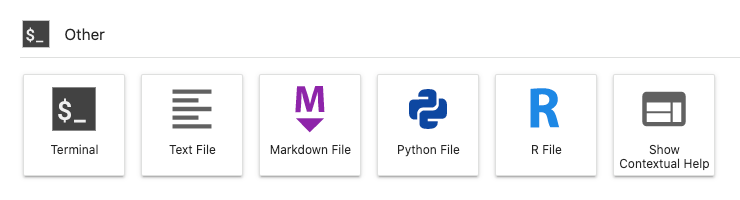

# FAQ on the Workbench

**This page contain frequently asked questions on your Workbench in your lab. Help us expand this section by sending us your questions and burning topics.**

[[toc]]

## Storage

### Where is my data?

Workbench uses the same storages volumes as your home machine. This means that you can access all lab data, including your home directory, using the same paths in your scripts, for example: 

```bash
/mnt/archive/<my-data-folder>
```

### Where is my code stored?

Jupyter Notebooks and code are stored in the shared `work` volume on your home machine:

```bash
/mnt/work/workbench
```

## Reproducibility

### Can I create my own Conda environment for Jupyter?

Yes. Here's an example on how you create a Conda environments with Python and IPython kernel:

```
conda create -n <name> 'python==3.8' 'ipykernel'
```

And here's an example on how you create a Conda environment with R and R-IRkernel kernel:

```
conda create -n <name> 'r-base>=4.0,<4.1' 'r-irkernel' 'r-devtools'
```

### How can I start a Notebook with my new Conda environment?

Here is an example of Notebooks that are connected to Conda environments.


### How do I change the Conda environment for my Notebook?

You can also change Conda environment of your Jupyter Notebook later, by switching the kernel:


You will be able to select default environments including MATLAB kernel and custom environments which contain either `ipykernel` (Python) or `r-irkernel` (R 4.0):


## Management

### How can I scrape my server and start from scratch?

Select control panel in top right corner:


Then in the control panel hit stop server:


You can either start the new instance by hitting the button or by logging in again.

### Can I install Jupyter extensions?

No. Due to security reasons, this is currently not allowed and the Jupyter extension manager is disabled. Feel free to reach out to us on Slack so we can discuss adding useful extensions into your Workbench.

## MATLAB

### Are there any limitations to MATLAB in Workbench?

Yes, some limitations may apply. Read more in the [official documentation](https://se.mathworks.com/products/matlab-online/limitations.html) from MathWorks.

### How do I report issues with MATLAB?

Try to note down times when the issues occurred and collect the error logs from Status information window.
Additionally you could also help by taking a screenshot of error logs in browser console.
Usually you can open the console with a shortcut: `CTRL + SHIFT + J` (MacOS: `CMD + Option + J`), but this can vary between browsers. Share these logs with us on slack, or feel free to [contact us on email](https://docs.hdc.ntnu.no/contact/).

### How can I increase the number of parallel workers?

If you already have "Parallel Computing Toolbox" and cannot set the higher number parallel workers in the pool, Select "Parallel" menu and click on "Create and Manage Clusters":


Then hit "Edit" and update the "NumWorkers" value (usually number of CPUs):


## RStudio

### Which R version is available in RStudio? 

The current Workbench version of R is `R 4.0`.

### How do I install my own R packages? 

If you want to install your own packages, we recommend to use [Conda](/working-in-your-lab/analytical-tools/conda/) for reliability as `install.packages()` inside R will be unreliable. To install a package, run the following code in your [Workbench Terminal](/working-in-your-lab/workbench/faq/#terminal):

```bash
# -- Principal example
conda install -n r-base -c conda-forge r-'<package-name>' r-'<another-package-name>'

# -- Practical example*
conda install -n r-base -c conda-forge r-dplyr
```

RStudio is configured to use packages installed in the environment named `r-base` as shown above. For example, the above example installs the [dplyr package](https://anaconda.org/conda-forge/r-dplyr). When the installation is complete, open R in your Workbench and load your new package: 

```bash 
# -- Principal example
library(<package-name>)

# -- Practical example
library(dplyr)
```

## Terminal

You can find the workbench terminal in main view of applications under the section: Other.



Terminal can be used to manage [Conda packages](/working-in-your-lab/analytical-tools/conda/), monitor resources (htop), or to handle other tasks.


