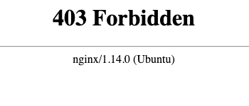

# Workbench troubleshooting

**Unfortunately, sometimes things don't work as intended. Here is a collect of issues you might encounter in your workbench. Contact us if you are still stuck after reading up.**

[[toc]]

::: tip

See our [workbench FAQ](/working-in-your-lab/workbench/faq/) for general questions about the workbench..

:::

## Access

### I am unable to access my Workbench applications?

If you were previously able to access your applications in Workbench (e.g. RStudio), and then the application suddenly stopped working, one quick approach is to try restarting your Workbench environment. Follow the guide to [restart Workbench environment](/working-in-your-lab/workbench/faq/#how-can-i-restart-my-workbench-environment-and-start-from-scratch). [Contact us](/contact) if you need further assistance.

### Has my client certificate expired (403 Forbidden)?

Your Workbench certificate is time limited. You will meet the **`403 Forbidden`** message below when your certificate expire. Head over to the [service desk](/service-desk/user-orders/#workbench-reissue) to order a new.



### Has my lab certificate expired?

If you were previously able to access Workbench and now your browser reports expired/unsafe certificates do not hesitate to contact us on [email](/contact) or Slack, we can usually update lab certificates pretty quickly.


## RStudio

### 500: Internal Server Error

If you are a fast clicker and get to an app before it's initialized in the background you might get error message:

```
500: Internal Server Error

Could not start rstudio in time
```

Try reloading the page (`Ctrl + R` / `CMD + R`) to reconnect with RStudio session.
[Contact us](/contact) if the error message persists.

## MATLAB

### Icons in user interface disappeared

If MATLAB icons disappeared and application is stuck loading you will need to reset user settings.

[matlab icons missing](./images/matlab_icons_missing.png)

Removing user settings can be done in Workbench terminal:

```
ls /mnt/work/workbench/$USER/.matlab
rm -r /mnt/work/workbench/$USER/.matlab
```

## Experience

### Unresponsive workbench

An unresponsive or slow workbench may be caused by several things. Here's a small checklist to narrow down potential causes:

- Use Google Chrome as your browser. Other browsers don't support all features and might cause potential silent failures.

- Restart your workbench environment to start fresh in the case something got hung up. [Click here](/working-in-your-lab/workbench/faq/#how-can-i-restart-my-workbench-environment) to see how.

- Check the resource consumption of your `home`-machine to ensure that you have availble free memory and cpu resources, for example by logging into your lab `home`-machine and run [htop](/working-in-your-lab/technical-tools/htop/). Consider to upgrade your machine size in the [service desk](/service-desk/lab-orders/#update-machine-size) if your are low on free resources.

[Contact us](/contact) if none of these works for further investigation.
