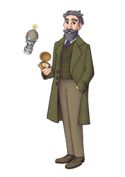

<!-- NOTE: This page is autogenerated.  -->
<!--       All manual edits will be removed.  -->

# Illustrations - Characters

**Ingress.**
 
[[toc]]

::: tip
We are publishing these illustrations under a `CC BY­-NC-­ND 4.0` license. This means that you are free to use, share, copy and redistribute the works under just a few simple terms ([license](/about/illustrations/#license)).
:::

## That feeling

. 

::: details Download

* [Full](https://assets.hdc.ntnu.no/assets/artworks/hunt-cloud_that-feeling_full.jpg) - 3508 x 4961 pixels - 5,1M
* [Medium](https://assets.hdc.ntnu.no/assets/artworks/hunt-cloud_that-feeling_medium.jpg) - 1358 x 1920 pixels - 1,1M
* [Small](https://assets.hdc.ntnu.no/assets/artworks/hunt-cloud_that-feeling_small.jpg) - 764 x 1080 pixels - 392K
* [Extra small](https://assets.hdc.ntnu.no/assets/artworks/hunt-cloud_that-feeling_xsmall.jpg) - 177 x 250 pixels - 36K

**Title:** That feeling  
**Creator:** Ingunn B. Ferstad, HUNT Cloud / NTNU.  
**License:** CC BY­-NC-­ND 4.0  
**Year:** 2021  
**Version:** 1.0  
**ArtworkID:** hcc-artwork1 
:::

::: details Reflections

.

.

:::

::: details Use

.

:::

## Senior guidance

. 

::: details Download

* [Full](https://assets.hdc.ntnu.no/assets/artworks/hunt-cloud_senior-guidance_full.jpg) - 3508 x 4961 pixels - 3,6M
* [Medium](https://assets.hdc.ntnu.no/assets/artworks/hunt-cloud_senior-guidance_medium.jpg) - 1358 x 1920 pixels - 649K
* [Small](https://assets.hdc.ntnu.no/assets/artworks/hunt-cloud_senior-guidance_small.jpg) - 764 x 1080 pixels - 229K
* [Extra small](https://assets.hdc.ntnu.no/assets/artworks/hunt-cloud_senior-guidance_xsmall.jpg) - 177 x 250 pixels - 25K

**Title:** Senior guidance  
**Creator:** Ingunn B. Ferstad, HUNT Cloud / NTNU.  
**License:** CC BY­-NC-­ND 4.0  
**Year:** 2023  
**Version:** 1.0  
**ArtworkID:** hcc-artwork25 
:::

::: details Reflections

.

:::

::: details Use

.

:::

