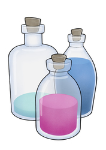
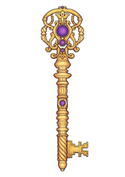
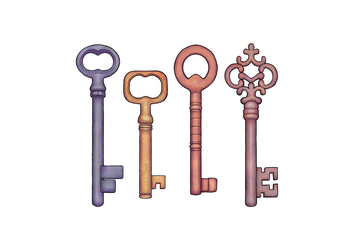
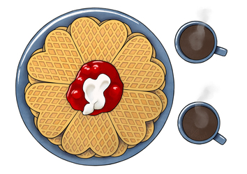
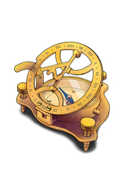
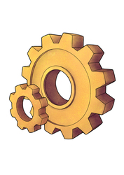
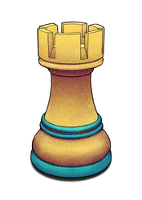
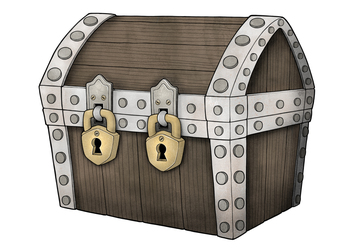
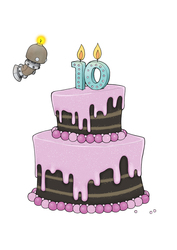

<!-- NOTE: This page is autogenerated.  -->
<!--       All manual edits will be removed.  -->

# Illustrations - Objects

**Ingress.**
 
[[toc]]

::: tip
We are publishing these illustrations under a `CC BY­-NC-­ND 4.0` license. This means that you are free to use, share, copy and redistribute the works under just a few simple terms ([license](/about/illustrations/#license)).
:::

## Bottle of knowledge

Knowledge is the currency in science. This is what we seek with our explorations. It's derived from data. It's not oil nor gold, although it resembles some of the same characteristics. It's essential to keep it flowing as knowledge empowers both your personal career and our joint journey towards a better world. 

::: details Download

* [Full](https://assets.hdc.ntnu.no/assets/artworks/hunt-cloud_bottle-of-knowledge_full.jpg) - 2480 x 3508 pixels - 2,0M
* [Medium](https://assets.hdc.ntnu.no/assets/artworks/hunt-cloud_bottle-of-knowledge_medium.jpg) - 1357 x 1920 pixels - 986K
* [Small](https://assets.hdc.ntnu.no/assets/artworks/hunt-cloud_bottle-of-knowledge_small.jpg) - 764 x 1080 pixels - 368K
* [Extra small](https://assets.hdc.ntnu.no/assets/artworks/hunt-cloud_bottle-of-knowledge_xsmall.jpg) - 177 x 250 pixels - 33K

**Title:** Bottle of knowledge  
**Creator:** Ingunn B. Ferstad, HUNT Cloud / NTNU.  
**License:** CC BY­-NC-­ND 4.0  
**Year:** 2023  
**Version:** 1.0  
**ArtworkID:** hcc-artwork12 
:::

::: details Reflections

.

:::

::: details Use

We use this image to illustrate, 

* that new **knowledge is the goal** of data explorations and what our scientists tireless seeks.
* that **flow** is essential in knowledge generation (we are using liquid metaphors). 
* that **data is the raw material** that goes into the production of knowledge.
* that **data differ qualitatively from oil and gold**, for example in duration and monitization, although some are partly similar (needs refinements, end products holds high value).

:::

## Bottles of data

. 

::: details Download

* [Full](https://assets.hdc.ntnu.no/assets/artworks/hunt-cloud_bottles-of-data_full.jpg) - 2480 x 3508 pixels - 2,6M
* [Medium](https://assets.hdc.ntnu.no/assets/artworks/hunt-cloud_bottles-of-data_medium.jpg) - 1357 x 1920 pixels - 908K
* [Small](https://assets.hdc.ntnu.no/assets/artworks/hunt-cloud_bottles-of-data_small.jpg) - 764 x 1080 pixels - 300K
* [Extra small](https://assets.hdc.ntnu.no/assets/artworks/hunt-cloud_bottles-of-data_xsmall.jpg) - 177 x 250 pixels - 31K

**Title:** Bottles of data  
**Creator:** Ingunn B. Ferstad, HUNT Cloud / NTNU.  
**License:** CC BY­-NC-­ND 4.0  
**Year:** 2023  
**Version:** 1.0  
**ArtworkID:** hcc-artwork13 
:::

::: details Reflections

.

:::

::: details Use

.

:::

## The keymakers

High impact science is about exploring the unknown. You will meet previously unopened doors on these journeys. Unpicking the most difficult locks requires custom keys. These are often carefully crafted, blending wisdom from humanities, social sciences, technologies and administration. Helpers from these fields are your keymakers. 

::: details Download

* [Full](https://assets.hdc.ntnu.no/assets/artworks/hunt-cloud_the-keymakers_full.jpg) - 2480 x 3508 pixels - 1,6M
* [Medium](https://assets.hdc.ntnu.no/assets/artworks/hunt-cloud_the-keymakers_medium.jpg) - 1357 x 1920 pixels - 649K
* [Small](https://assets.hdc.ntnu.no/assets/artworks/hunt-cloud_the-keymakers_small.jpg) - 764 x 1080 pixels - 248K
* [Extra small](https://assets.hdc.ntnu.no/assets/artworks/hunt-cloud_the-keymakers_xsmall.jpg) - 177 x 250 pixels - 28K

**Title:** The keymakers  
**Creator:** Ingunn B. Ferstad, HUNT Cloud / NTNU.  
**License:** CC BY­-NC-­ND 4.0  
**Year:** 2023  
**Version:** 1.0  
**ArtworkID:** hcc-artwork8 
:::

::: details Reflections

.

.

:::

::: details Use

We use this image to illustrate that, 

* high-impact science on sensitive data do often **explore data and methods in new ways** not previously done.
* such innovative activities often will meet **new challenges in legal, ethical and/or technological areas** that have not been previously solved.
* **flow in such projects is often dependant on new or customized solutions** in legal, ethical or technological areas.
* that **other areas of humanities** and social sciences such as language (e.g. choice of words) and writing (understandable across domains), art, history and cultural context (anthropology) and similar areas often are key to communicate new ideas in trustworthy ways to interested parties.
* **identifying and recruiting your team of helpers** (keymakers) is essensial to keep complex projects moving.
* we see **scientific coordinators** as the driving force and orchestrators of the custom keymaking process.

:::

## Keys in stock

Luckily, many keys are already available in stock and ready to be picked up in HUNT Cloud. Collectively crafted for known doors. Caringly handed over so you can instantly advance your activities. 

::: details Download

* [Full](https://assets.hdc.ntnu.no/assets/artworks/hunt-cloud_keys-in-stock_full.jpg) - 4961 x 3508 pixels - 2,8M
* [Medium](https://assets.hdc.ntnu.no/assets/artworks/hunt-cloud_keys-in-stock_medium.jpg) - 2715 x 1920 pixels - 1,1M
* [Small](https://assets.hdc.ntnu.no/assets/artworks/hunt-cloud_keys-in-stock_small.jpg) - 1527 x 1080 pixels - 358K
* [Extra small](https://assets.hdc.ntnu.no/assets/artworks/hunt-cloud_keys-in-stock_xsmall.jpg) - 354 x 250 pixels - 38K

**Title:** Keys in stock  
**Creator:** Ingunn B. Ferstad, HUNT Cloud / NTNU.  
**License:** CC BY­-NC-­ND 4.0  
**Year:** 2023  
**Version:** 1.0  
**ArtworkID:** hcc-artwork9 
:::

::: details Reflections

.

:::

::: details Use

We use this image to illustrate that,

* **solutions to common problems may already be available**, for example agreed security measures for specific data providers, predefined agreement setups, machine learning equipment, software solutions and so forth;
* we work hard to continously **develop and evolve stock solutions** together with our cloud community;
* our goal is to **make all stock solutions available to all users as soon as possible** to elevate activities for as many of you as possible.

:::

## Waffle dialogues

. 

::: details Download

* [Full](https://assets.hdc.ntnu.no/assets/artworks/hunt-cloud_waffle-dialogues_full.jpg) - 3508 x 2480 pixels - 3,5M
* [Medium](https://assets.hdc.ntnu.no/assets/artworks/hunt-cloud_waffle-dialogues_medium.jpg) - 2716 x 1920 pixels - 2,6M
* [Small](https://assets.hdc.ntnu.no/assets/artworks/hunt-cloud_waffle-dialogues_small.jpg) - 1528 x 1080 pixels - 1008K
* [Extra small](https://assets.hdc.ntnu.no/assets/artworks/hunt-cloud_waffle-dialogues_xsmall.jpg) - 354 x 250 pixels - 93K

**Title:** Waffle dialogues  
**Creator:** Ingunn B. Ferstad, HUNT Cloud / NTNU.  
**License:** CC BY­-NC-­ND 4.0  
**Year:** 2023  
**Version:** 1.0  
**ArtworkID:** hcc-artwork24 
:::

::: details Reflections

.

:::

::: details Use

.

:::

## Strategic compass

Trust enables science. Explorations in unknown terrain, often at a competitive pace, place great demands on trustworthy navigation. Ground your course over a solid moral and value-based compass, buckle up, and enjoy the ride! 

::: details Download

* [Full](https://assets.hdc.ntnu.no/assets/artworks/hunt-cloud_strategic-compass_full.jpg) - 2480 x 3508 pixels - 2,8M
* [Medium](https://assets.hdc.ntnu.no/assets/artworks/hunt-cloud_strategic-compass_medium.jpg) - 1357 x 1920 pixels - 1,2M
* [Small](https://assets.hdc.ntnu.no/assets/artworks/hunt-cloud_strategic-compass_small.jpg) - 764 x 1080 pixels - 420K
* [Extra small](https://assets.hdc.ntnu.no/assets/artworks/hunt-cloud_strategic-compass_xsmall.jpg) - 177 x 250 pixels - 40K

**Title:** Strategic compass  
**Creator:** Ingunn B. Ferstad, HUNT Cloud / NTNU.  
**License:** CC BY­-NC-­ND 4.0  
**Year:** 2023  
**Version:** 1.0  
**ArtworkID:** hcc-artwork15 
:::

::: details Reflections

.

:::

::: details Use

We use this image to illustrate that, 

. 

:::

## A fine balance

. 

::: details Download

* [Full](https://assets.hdc.ntnu.no/assets/artworks/hunt-cloud_a-fine-balance_full.jpg) - 3508 x 4961 pixels - 3,4M
* [Medium](https://assets.hdc.ntnu.no/assets/artworks/hunt-cloud_a-fine-balance_medium.jpg) - 1358 x 1920 pixels - 666K
* [Small](https://assets.hdc.ntnu.no/assets/artworks/hunt-cloud_a-fine-balance_small.jpg) - 764 x 1080 pixels - 270K
* [Extra small](https://assets.hdc.ntnu.no/assets/artworks/hunt-cloud_a-fine-balance_xsmall.jpg) - 177 x 250 pixels - 32K

**Title:** A fine balance  
**Creator:** Ingunn B. Ferstad, HUNT Cloud / NTNU.  
**License:** CC BY­-NC-­ND 4.0  
**Year:** 2023  
**Version:** 1.0  
**ArtworkID:** hcc-artwork10 
:::

::: details Reflections

.

:::

::: details Use

.

:::

## Computational power

::: details Download

* [Full](https://assets.hdc.ntnu.no/assets/artworks/hunt-cloud_computational-power_full.jpg) - 2480 x 3508 pixels - 3,3M
* [Medium](https://assets.hdc.ntnu.no/assets/artworks/hunt-cloud_computational-power_medium.jpg) - 1357 x 1920 pixels - 1,3M
* [Small](https://assets.hdc.ntnu.no/assets/artworks/hunt-cloud_computational-power_small.jpg) - 764 x 1080 pixels - 447K
* [Extra small](https://assets.hdc.ntnu.no/assets/artworks/hunt-cloud_computational-power_xsmall.jpg) - 177 x 250 pixels - 40K

**Title:** Computational power  
**Creator:** Ingunn B. Ferstad, HUNT Cloud / NTNU.  
**License:** CC BY­-NC-­ND 4.0  
**Year:** 2023  
**Version:** 1.0  
**ArtworkID:** hcc-artwork11 
:::

::: details Reflections

.

:::

::: details Use

.

:::

## Tactical development

. 

::: details Download

* [Full](https://assets.hdc.ntnu.no/assets/artworks/hunt-cloud_tactical-development_full.jpg) - 2480 x 3508 pixels - 3,7M
* [Medium](https://assets.hdc.ntnu.no/assets/artworks/hunt-cloud_tactical-development_medium.jpg) - 1357 x 1920 pixels - 1,3M
* [Small](https://assets.hdc.ntnu.no/assets/artworks/hunt-cloud_tactical-development_small.jpg) - 764 x 1080 pixels - 436K
* [Extra small](https://assets.hdc.ntnu.no/assets/artworks/hunt-cloud_tactical-development_xsmall.jpg) - 177 x 250 pixels - 36K

**Title:** Tactical development  
**Creator:** Ingunn B. Ferstad, HUNT Cloud / NTNU.  
**License:** CC BY­-NC-­ND 4.0  
**Year:** 2023  
**Version:** 1.0  
**ArtworkID:** hcc-artwork7 
:::

::: details Reflections

.

:::

::: details Use

.

:::

## Chest for data transport

. 

::: details Download

* [Full](https://assets.hdc.ntnu.no/assets/artworks/hunt-cloud_chest-for-data-transport_full.jpg) - 3508 x 2480 pixels - 4,0M
* [Medium](https://assets.hdc.ntnu.no/assets/artworks/hunt-cloud_chest-for-data-transport_medium.jpg) - 2716 x 1920 pixels - 2,7M
* [Small](https://assets.hdc.ntnu.no/assets/artworks/hunt-cloud_chest-for-data-transport_small.jpg) - 1528 x 1080 pixels - 954K
* [Extra small](https://assets.hdc.ntnu.no/assets/artworks/hunt-cloud_chest-for-data-transport_xsmall.jpg) - 354 x 250 pixels - 70K

**Title:** Chest for data transport  
**Creator:** Ingunn B. Ferstad, HUNT Cloud / NTNU.  
**License:** CC BY­-NC-­ND 4.0  
**Year:** 2023  
**Version:** 1.1  
**ArtworkID:** hcc-artwork14 
:::

::: details Reflections

.

:::

::: details Use

.

:::

## Ten year anniversary cake

. 

::: details Download

* [Full](https://assets.hdc.ntnu.no/assets/artworks/hunt-cloud_ten-year-anniversary-cake_full.jpg) - 3508 x 4961 pixels - 2,6M
* [Medium](https://assets.hdc.ntnu.no/assets/artworks/hunt-cloud_ten-year-anniversary-cake_medium.jpg) - 1358 x 1920 pixels - 663K
* [Small](https://assets.hdc.ntnu.no/assets/artworks/hunt-cloud_ten-year-anniversary-cake_small.jpg) - 764 x 1080 pixels - 282K
* [Extra small](https://assets.hdc.ntnu.no/assets/artworks/hunt-cloud_ten-year-anniversary-cake_xsmall.jpg) - 177 x 250 pixels - 32K

**Title:** Ten year anniversary cake  
**Creator:** Ingunn B. Ferstad, HUNT Cloud / NTNU.  
**License:** CC BY­-NC-­ND 4.0  
**Year:** 2023  
**Version:** 1.0  
**ArtworkID:** hcc-artwork16 
:::

::: details Reflections

.

:::

::: details Use

.

:::

