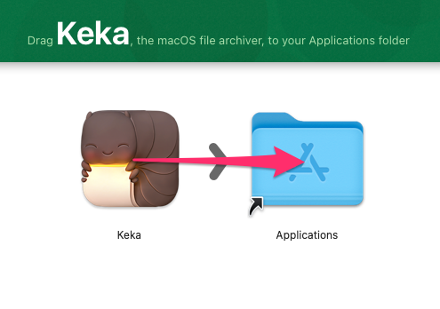
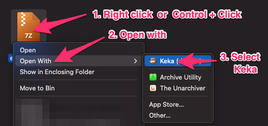

# Keka

## Installation

1. Try with <a href="https://d.keka.io/" target="_blank">direct download link</a>.

If the download link did not work open <a href="https://www.keka.io/en/" target="_blank">Keka - official website</a> and find download link below the black button, according to the image:

2. Open Keka dmg file

3. Drag and drop Keka into Applications

## Opening archives

Opening archive with Keka:

