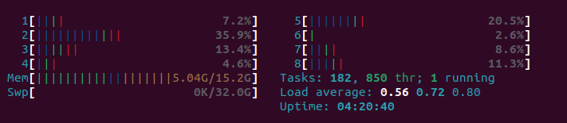
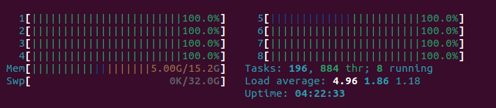

# Htop

**[Htop](https://en.wikipedia.org/wiki/Htop) a top-like tool that can display information
about the resource utilization in your lab machine. You can use this to check wether its time for a clean up or upgrade in your lab**

[[toc]]

## Installation 

Log into your lab machine and install **`htop`** with the following code: 

```
sudo apt install htop
```

## Run

To start **`htop`**, simply run:

```
htop
```

Exist by **`htop`** by pressing character **`q`** on your keyboard.

## Examples

### Low utilization



The above image shows a calm and low stress resource situation for a 8 CPU and 16 GB ram lab machine.

**CPU** The rows named 1 to 8 indicate the utilization of each CPU. The example shows utilization from 2.6 to 35.9 percentage, with a **`Load average`** (lower right quadrant) of 0.56.

**Memory**: The row named **`Mem`** shows that 5.04GB aout of 15.2 GB is used. This should allow for quick responses.

In low utilization cases, you may consider to downsize your lab machine.

### High utilization



The above image shows a situation where all CPUs are fully utilized. This is an optimal state if you are running large-scale anlaytics. However, for home machines with many users such utilization may cause laggy user experiences. 

In high utilization cases, you may limit your CPU and/or memory use to allow room for other users, run your processes with [lower priority](https://www.computerhope.com/unix/unice.htm), request a larger machine etc. Feel free to [contact us](/contact) for advice.

## Read more

* [A beginners guide to htop for process management](https://spin.atomicobject.com/2020/02/10/htop-guide/) 
* [Htop explained - Explanation of everything you can see in htop/top on Linux.](https://peteris.rocks/blog/htop/)
* [Htop versus Top in Linux](https://www.tecmint.com/htop-vs-top-in-linux/)


