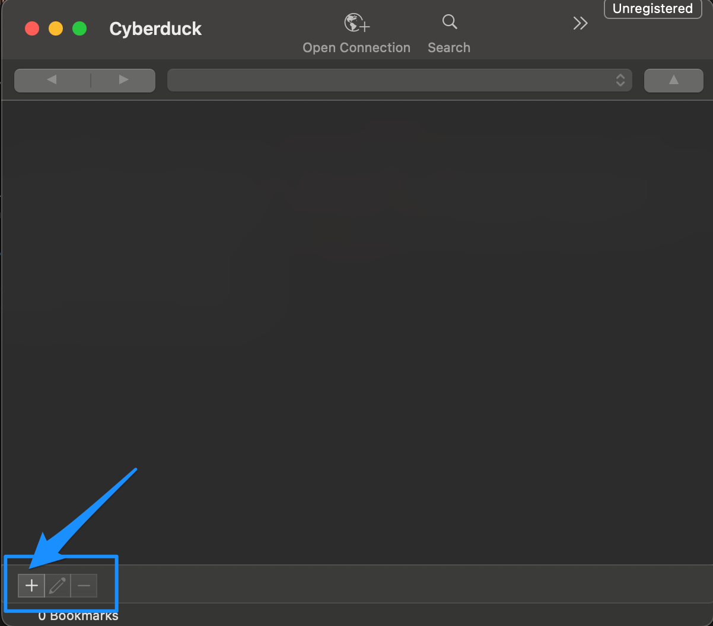
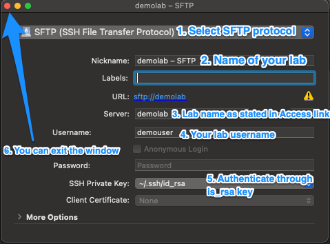
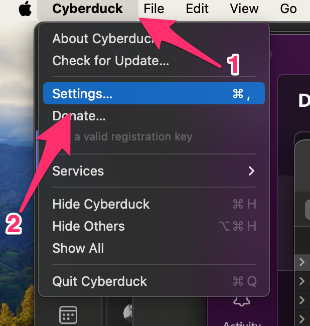
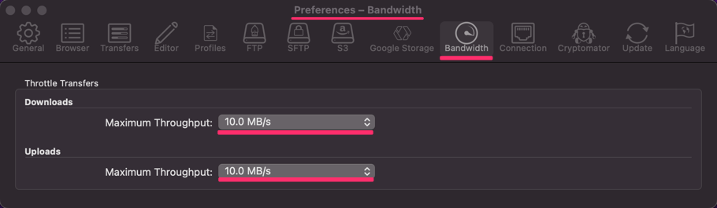
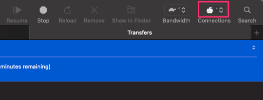
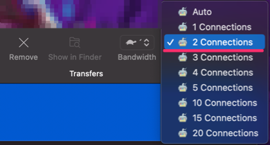

# Cyberduck

Is a free software for convenient file transfers between your macOS laptop and lab. 

[[toc]]

## Download
You can download free version of Cyberduck through their main [webpage](https://cyberduck.io/download/). Once you download the app, follow instructions on screen for quick install.

## Setup connection to your lab

1. You will need to setup your `hosts file` and `SSH config file` according to your customized Access link which you received during your onboarding.

2. After you open the app, you should see following window. Select + sign in bottom left corner in order to setup new connection

3. New window should pop-up. Fill in details as described in below image. 

4. Double-click on your new connection. You should successfully connect to your lab *home* node.

## How to transfer your files

You can confirm correct setup by checking if your `archive` and `work` directory are avialable in Cyberduck. 
Then, you are able to download/upload file by simple drag-n-drop or right clicking on your files and selecting *Download to*.

## Recommended settings
### Setting for limiting bandwith 

1. Click settings under Cyberduck in the toolbar on top of the screen

2. Click the bandwith icon and change both options to 10MB/s

### Settings during transfer

Setting for limiting transfer connections to fairly share bandwith with others. 

1. Click the connection icon in the top right corner 

2. Select the option for 2 connections

## Immediate troubleshooting

### What is my lab IP address ?
You can find you lab IP address in config.txt file sent over to your email or via access link which you were provided during initial onboarding. Cannot find lab access link ? Request your lab access link [here](https://docs.hdc.ntnu.no/do-science/service-desk/#request-lab-access-link-reissue)

